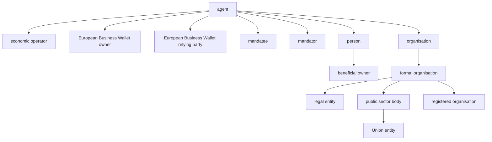
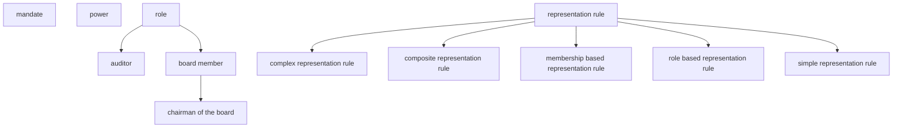
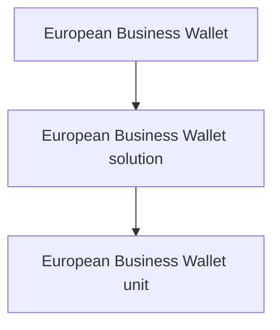
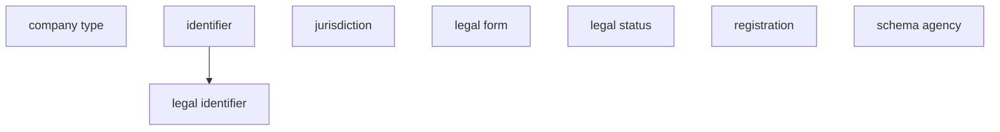
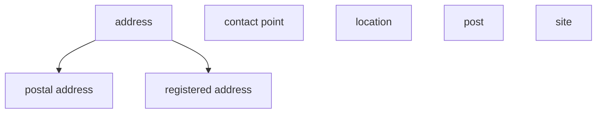
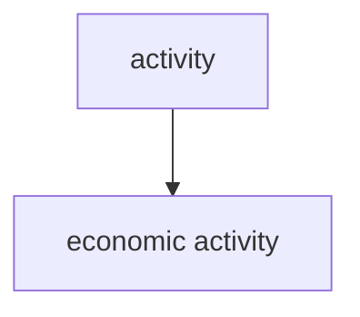
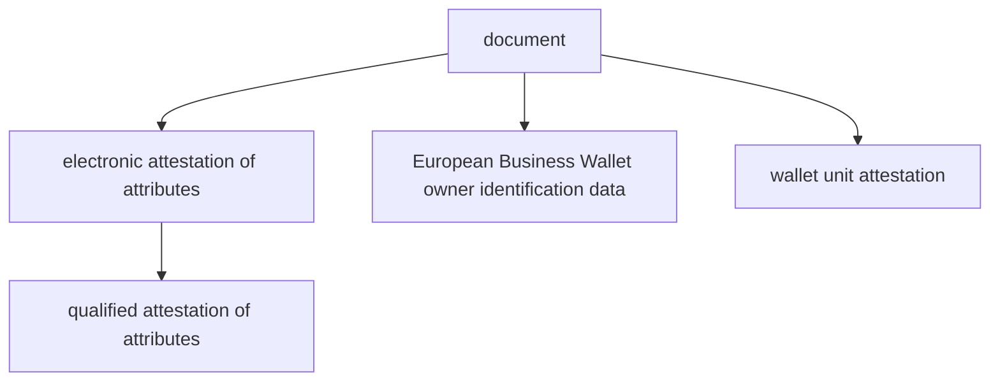

# Nordic Core Business Terminology

[Back to top](#nordic-core-business-terminology)

## Concept Groups

- [Business parties and organisations](#business-parties-and-organisations)
- [Roles, mandates and representation](#roles-mandates-and-representation)
- [European Business Wallet](#european-business-wallet)
- [Identification and legal attributes](#identification-and-legal-attributes)
- [Locations and contact information](#locations-and-contact-information)
- [Activities and processes](#activities-and-processes)
- [Documents and attestations](#documents-and-attestations)
- [Financial reporting](#financial-reporting)
- [General and supporting concepts](#general-and-supporting-concepts)

---

## Business parties and organisations

- [agent](#agent)
- [beneficial owner](#beneficial-owner)
- [economic operator](#economic-operator)
- [European Business Wallet owner](#european-business-wallet-owner)
- [European Business Wallet relying party](#european-business-wallet-relying-party)
- [formal organisation](#formal-organisation)
- [legal entity](#legal-entity)
- [mandatee](#mandatee)
- [mandator](#mandator)
- [organisation](#organisation)
- [person](#person)
- [public sector body](#public-sector-body)
- [registered organisation](#registered-organisation)
- [Union entity](#union-entity)

### Diagram

[Back to top](#nordic-core-business-terminology)

---

## Roles, mandates and representation

- [auditor](#auditor)
- [board member](#board-member)
- [chairman of the board](#chairman-of-the-board)
- [complex representation rule](#complex-representation-rule)
- [composite representation rule](#composite-representation-rule)
- [mandate](#mandate)
- [membership based representation rule](#membership-based-representation-rule)
- [power](#power)
- [representation rule](#representation-rule)
- [role](#role)
- [role based representation rule](#role-based-representation-rule)
- [simple representation rule](#simple-representation-rule)

### Diagram

[Back to top](#nordic-core-business-terminology)

---

## European Business Wallet

- [European Business Wallet](#european-business-wallet)
- [European Business Wallet solution](#european-business-wallet-solution)
- [European Business Wallet unit](#european-business-wallet-unit)

### Diagram

[Back to top](#nordic-core-business-terminology)

---

## Identification and legal attributes

- [company type](#company-type)
- [identifier](#identifier)
- [jurisdiction](#jurisdiction)
- [legal form](#legal-form)
- [legal identifier](#legal-identifier)
- [legal status](#legal-status)
- [registration](#registration)
- [schema agency](#schema-agency)

### Diagram

[Back to top](#nordic-core-business-terminology)

---

## Locations and contact information

- [address](#address)
- [contact point](#contact-point)
- [location](#location)
- [post](#post)
- [postal address](#postal-address)
- [registered address](#registered-address)
- [site](#site)

### Diagram

[Back to top](#nordic-core-business-terminology)

---

## Activities and processes

- [activity](#activity)
- [economic activity](#economic-activity)

### Diagram

[Back to top](#nordic-core-business-terminology)

---

## Documents and attestations

- [document](#document)
- [electronic attestation of attributes](#electronic-attestation-of-attributes)
- [European Business Wallet owner identification data](#european-business-wallet-owner-identification-data)
- [qualified attestation of attributes](#qualified-attestation-of-attributes)
- [wallet unit attestation](#wallet-unit-attestation)

### Diagram

[Back to top](#nordic-core-business-terminology)

---

## Financial reporting

- [administrative expenses](#administrative-expenses)

### Diagram

[Back to top](#nordic-core-business-terminology)

---

## General and supporting concepts

- [alternative name](#alternative-name)
- [business name](#business-name)
- [care of](#care-of)
- [company](#company)
- [company name](#company-name)
- [company status](#company-status)
- [cost of sales](#cost-of-sales)
- [date of birth](#date-of-birth)
- [delegable](#delegable)
- [deputy board member](#deputy-board-member)
- [deputy managing director](#deputy-managing-director)
- [Distribution costs](#distribution-costs)
- [duration of the legal entity](#duration-of-the-legal-entity)
- [entity](#entity)
- [Financial income](#financial-income)
- [full name](#full-name)
- [Gross profit or loss](#gross-profit-or-loss)
- [Income from other investments and loans forming part of the fixed assets, with a separate indication of that derived from affiliated undertakings](#income-from-other-investments-and-loans-forming-part-of-the-fixed-assets-with-a-separate-indication-of-that-derived-from-affiliated-undertakings)
- [Income from participating interests, with a separate indication of that derived from affiliated undertakings](#income-from-participating-interests-with-a-separate-indication-of-that-derived-from-affiliated-undertakings)
- [Interest payable and similar expenses, with a separate indication of amounts payable to affiliated undertakings](#interest-payable-and-similar-expenses-with-a-separate-indication-of-amounts-payable-to-affiliated-undertakings)
- [legal name](#legal-name)
- [legal resource](#legal-resource)
- [mandate transfer](#mandate-transfer)
- [membership](#membership)
- [monetary amount](#monetary-amount)
- [name](#name)
- [Net turnover](#net-turnover)
- [notation](#notation)
- [object](#object)
- [Other external expenses](#other-external-expenses)
- [Other interest receivable and similar income, with a separate indication of that derived from affiliated undertakings](#other-interest-receivable-and-similar-income-with-a-separate-indication-of-that-derived-from-affiliated-undertakings)
- [Other operating expenses](#other-operating-expenses)
- [Other operating income](#other-operating-income)
- [Other taxes not shown under items 1 to 15](#other-taxes-not-shown-under-items-1-to-15)
- [Profit or loss after taxation](#profit-or-loss-after-taxation)
- [Profit or loss for the financial year](#profit-or-loss-for-the-financial-year)
- [Raw materials and consumables](#raw-materials-and-consumables)
- [registration date](#registration-date)
- [representation right](#representation-right)
- [restriction](#restriction)
- [scope](#scope)
- [share](#share)
- [share capital](#share-capital)
- [shareholder](#shareholder)
- [signatory](#signatory)
- [Social security costs, with a separate indication of those relating to pensions](#social-security-costs-with-a-separate-indication-of-those-relating-to-pensions)
- [source](#source)
- [Staff costs](#staff-costs)
- [Tax on profit or loss](#tax-on-profit-or-loss)
- [Value adjustments](#value-adjustments)
- [Value adjustments in respect of current assets, to the extent that they exceed the amount of value adjustments which are normal in the undertakings](#value-adjustments-in-respect-of-current-assets-to-the-extent-that-they-exceed-the-amount-of-value-adjustments-which-are-normal-in-the-undertakings)
- [Value adjustments in respect of financial assets and of investments held as current assets](#value-adjustments-in-respect-of-financial-assets-and-of-investments-held-as-current-assets)
- [Value adjustments in respect of formation expenses and of tangible and intangible fixed assets](#value-adjustments-in-respect-of-formation-expenses-and-of-tangible-and-intangible-fixed-assets)
- [Variation in stocks of finished goods and in work in progress](#variation-in-stocks-of-finished-goods-and-in-work-in-progress)
- [Wages and salaries](#wages-and-salaries)
- [Work performed by the undertaking for its own purposes and capitalized](#work-performed-by-the-undertaking-for-its-own-purposes-and-capitalized)

[Back to top](#nordic-core-business-terminology)

---

## activity

**URI:** `https://iri.suomi.fi/terminology/nbvoc/concept-2001`

**Definition:** an active deed or action carried out by a legal entity

**Breadcrumb:** [Top](#nordic-core-business-terminology) > [activity](#activity)

**Broader:** None
**Narrower:** [registration](#registration), [economic activity](#economic-activity)
**Related:** [legal entity](#legal-entity)

[Back to top](#nordic-core-business-terminology)

---

## address

**URI:** `https://iri.suomi.fi/terminology/nbvoc/concept-4`

**Definition:** an identification of the fixed location of a geographic place

**Breadcrumb:** [Top](#nordic-core-business-terminology) > [address](#address)

**Broader:** None
**Narrower:** [registered address](#registered-address), [postal address](#postal-address)
**Related:** None

[Back to top](#nordic-core-business-terminology)

---

## administrative expenses

**URI:** `https://iri.suomi.fi/terminology/nbvoc/concept-6037`

**Definition:** NSG&B term for SA-B

**Breadcrumb:** [Top](#nordic-core-business-terminology) > [administrative expenses](#administrative-expenses)

**Broader:** None
**Narrower:** None
**Related:** None

[Back to top](#nordic-core-business-terminology)

---

## agent

**URI:** `https://iri.suomi.fi/terminology/nbvoc/concept-41`

**Definition:** an entity that is able to carry out actions

**Breadcrumb:** [Top](#nordic-core-business-terminology) > [entity](#entity) > [agent](#agent)

**Broader:** [entity](#entity)
**Narrower:** [European Business Wallet relying party](#european-business-wallet-relying-party), [economic operator](#economic-operator), [European Business Wallet owner](#european-business-wallet-owner), [organisation](#organisation), [person](#person)
**Related:** [public sector body](#public-sector-body), [role](#role)

[Back to top](#nordic-core-business-terminology)

---

## alternative name

**URI:** `https://iri.suomi.fi/terminology/nbvoc/concept-51`

**Definition:** any other registered name by which a legal entity is known

**Breadcrumb:** [Top](#nordic-core-business-terminology) > [name](#name) > [alternative name](#alternative-name)

**Broader:** [name](#name)
**Narrower:** None
**Related:** [legal entity](#legal-entity)

[Back to top](#nordic-core-business-terminology)

---

## auditor

**URI:** `https://iri.suomi.fi/terminology/nbvoc/concept-3010`

**Definition:** an independent person or organisation responsible for examining the accounts and governance of a legal entity and issuing an audit opinion

**Breadcrumb:** [Top](#nordic-core-business-terminology) > [role](#role) > [auditor](#auditor)

**Broader:** [role](#role)
**Narrower:** None
**Related:** [legal resource](#legal-resource), [legal entity](#legal-entity)

[Back to top](#nordic-core-business-terminology)

---

## beneficial owner

**URI:** `https://iri.suomi.fi/terminology/nbvoc/concept-3002`

**Definition:** a person or persons who ultimately owns or controls an agent

**Breadcrumb:** [Top](#nordic-core-business-terminology) > [entity](#entity) > [agent](#agent) > [person](#person) > [beneficial owner](#beneficial-owner)

**Broader:** [person](#person)
**Narrower:** None
**Related:** [agent](#agent)

[Back to top](#nordic-core-business-terminology)

---

## board member

**URI:** `https://iri.suomi.fi/terminology/nbvoc/concept-3003`

**Definition:** a person who is a member of the governing board of a legal entity and participates in its decision-making

**Breadcrumb:** [Top](#nordic-core-business-terminology) > [role](#role) > [board member](#board-member)

**Broader:** [role](#role)
**Narrower:** [chairman of the board](#chairman-of-the-board)
**Related:** [membership](#membership), [legal entity](#legal-entity), [deputy board member](#deputy-board-member), [company](#company), [representation right](#representation-right)

[Back to top](#nordic-core-business-terminology)

---

## business name

**URI:** `https://iri.suomi.fi/terminology/nbvoc/concept-24`

**Definition:** Should be removed, we don't use it?

**Breadcrumb:** [Top](#nordic-core-business-terminology) > [name](#name) > [business name](#business-name)

**Broader:** [name](#name)
**Narrower:** None
**Related:** None

[Back to top](#nordic-core-business-terminology)

---

## care of

**URI:** `https://iri.suomi.fi/terminology/nbvoc/concept-6043`

**Definition:** Used when an address is at the address of another person or legal entity.

**Breadcrumb:** [Top](#nordic-core-business-terminology) > [care of](#care-of)

**Broader:** None
**Narrower:** None
**Related:** None

[Back to top](#nordic-core-business-terminology)

---

## chairman of the board

**URI:** `https://iri.suomi.fi/terminology/nbvoc/concept-3008`

**Definition:** a board member who chairs the board of a legal entity and typically has specific representation or signatory rights

**Breadcrumb:** [Top](#nordic-core-business-terminology) > [role](#role) > [board member](#board-member) > [chairman of the board](#chairman-of-the-board)

**Broader:** [board member](#board-member)
**Narrower:** None
**Related:** [legal entity](#legal-entity), [representation right](#representation-right), [mandate](#mandate)

[Back to top](#nordic-core-business-terminology)

---

## company

**URI:** `https://iri.suomi.fi/terminology/nbvoc/concept-0`

**Definition:** See legal entity

**Breadcrumb:** [Top](#nordic-core-business-terminology) > [company](#company)

**Broader:** None
**Narrower:** None
**Related:** [legal entity](#legal-entity), [board member](#board-member), [economic operator](#economic-operator)

[Back to top](#nordic-core-business-terminology)

---

## company name

**URI:** `https://iri.suomi.fi/terminology/nbvoc/concept-26`

**Definition:** See legal name

**Breadcrumb:** [Top](#nordic-core-business-terminology) > [company name](#company-name)

**Broader:** None
**Narrower:** None
**Related:** [legal name](#legal-name)

[Back to top](#nordic-core-business-terminology)

---

## company status

**URI:** `https://iri.suomi.fi/terminology/nbvoc/concept-33`

**Definition:** See legal status

**Breadcrumb:** [Top](#nordic-core-business-terminology) > [company status](#company-status)

**Broader:** None
**Narrower:** None
**Related:** [legal status](#legal-status)

[Back to top](#nordic-core-business-terminology)

---

## company type

**URI:** `https://iri.suomi.fi/terminology/nbvoc/concept-28`

**Definition:** See legal form

**Breadcrumb:** [Top](#nordic-core-business-terminology) > [company type](#company-type)

**Broader:** None
**Narrower:** None
**Related:** [legal form](#legal-form)

[Back to top](#nordic-core-business-terminology)

---

## complex representation rule

**URI:** `https://iri.suomi.fi/terminology/nbvoc/concept-80`

**Definition:** a representation rule that consists of two or more representation rules

**Breadcrumb:** [Top](#nordic-core-business-terminology) > [representation rule](#representation-rule) > [complex representation rule](#complex-representation-rule)

**Broader:** [representation rule](#representation-rule)
**Narrower:** None
**Related:** None

[Back to top](#nordic-core-business-terminology)

---

## composite representation rule

**URI:** `https://iri.suomi.fi/terminology/nbvoc/concept-82`

**Definition:** a representation rule that consist of two or more role or membership based representation rules

**Breadcrumb:** [Top](#nordic-core-business-terminology) > [representation rule](#representation-rule) > [composite representation rule](#composite-representation-rule)

**Broader:** [representation rule](#representation-rule)
**Narrower:** None
**Related:** [membership based representation rule](#membership-based-representation-rule), [role based representation rule](#role-based-representation-rule)

[Back to top](#nordic-core-business-terminology)

---

## contact point

**URI:** `https://iri.suomi.fi/terminology/nbvoc/concept-6044`

**Definition:** information through which one can get in touch with a person or a legal entity

**Breadcrumb:** [Top](#nordic-core-business-terminology) > [contact point](#contact-point)

**Broader:** None
**Narrower:** None
**Related:** [legal entity](#legal-entity), [person](#person)

[Back to top](#nordic-core-business-terminology)

---

## cost of sales

**URI:** `https://iri.suomi.fi/terminology/nbvoc/concept-6034`

**Definition:** NSG&B term for SA-B

**Breadcrumb:** [Top](#nordic-core-business-terminology) > [cost of sales](#cost-of-sales)

**Broader:** None
**Narrower:** None
**Related:** None

[Back to top](#nordic-core-business-terminology)

---

## date of birth

**URI:** `https://iri.suomi.fi/terminology/nbvoc/concept-6013`

**Definition:** a point in time on which a person was born

**Breadcrumb:** [Top](#nordic-core-business-terminology) > [date of birth](#date-of-birth)

**Broader:** None
**Narrower:** None
**Related:** [person](#person)

[Back to top](#nordic-core-business-terminology)

---

## delegable

**URI:** `https://iri.suomi.fi/terminology/nbvoc/concept-79`

**Definition:** capable of being delegated

**Breadcrumb:** [Top](#nordic-core-business-terminology) > [delegable](#delegable)

**Broader:** None
**Narrower:** None
**Related:** None

[Back to top](#nordic-core-business-terminology)

---

## deputy board member

**URI:** `https://iri.suomi.fi/terminology/nbvoc/concept-3007`

**Definition:** 

**Breadcrumb:** [Top](#nordic-core-business-terminology) > [deputy board member](#deputy-board-member)

**Broader:** None
**Narrower:** None
**Related:** [board member](#board-member)

[Back to top](#nordic-core-business-terminology)

---

## deputy managing director

**URI:** `https://iri.suomi.fi/terminology/nbvoc/concept-3006`

**Definition:** 

**Breadcrumb:** [Top](#nordic-core-business-terminology) > [deputy managing director](#deputy-managing-director)

**Broader:** None
**Narrower:** None
**Related:** None

[Back to top](#nordic-core-business-terminology)

---

## Distribution costs

**URI:** `https://iri.suomi.fi/terminology/nbvoc/concept-6036`

**Definition:** NSG&B term for SA-B

**Breadcrumb:** [Top](#nordic-core-business-terminology) > [Distribution costs](#distribution-costs)

**Broader:** None
**Narrower:** None
**Related:** None

[Back to top](#nordic-core-business-terminology)

---

## document

**URI:** `https://iri.suomi.fi/terminology/nbvoc/concept-93`

**Definition:** TBD

**Breadcrumb:** [Top](#nordic-core-business-terminology) > [document](#document)

**Broader:** None
**Narrower:** [electronic attestation of attributes](#electronic-attestation-of-attributes), [European Business Wallet owner identification data](#european-business-wallet-owner-identification-data)
**Related:** [European Business Wallet](#european-business-wallet)

[Back to top](#nordic-core-business-terminology)

---

## duration of the legal entity

**URI:** `https://iri.suomi.fi/terminology/nbvoc/concept-6042`

**Definition:** Specified time period for which a legal entity is intended to exist as outlined in its governing documents, such as the articles of association or equivalent legal documents.

**Breadcrumb:** [Top](#nordic-core-business-terminology) > [duration of the legal entity](#duration-of-the-legal-entity)

**Broader:** None
**Narrower:** None
**Related:** None

[Back to top](#nordic-core-business-terminology)

---

## economic activity

**URI:** `https://iri.suomi.fi/terminology/nbvoc/concept-2000`

**Definition:** an activity where resources are combined to produce specific goods or services

**Breadcrumb:** [Top](#nordic-core-business-terminology) > [activity](#activity) > [economic activity](#economic-activity)

**Broader:** [activity](#activity)
**Narrower:** None
**Related:** None

[Back to top](#nordic-core-business-terminology)

---

## economic operator

**URI:** `https://iri.suomi.fi/terminology/nbvoc/concept-94`

**Definition:** a natural person, legal person or group of such persons, including temporary associations of undertakings, when acting in a commercial or professional capacity for purposes related to their trade, business, craft or profession

**Breadcrumb:** [Top](#nordic-core-business-terminology) > [entity](#entity) > [agent](#agent) > [economic operator](#economic-operator)

**Broader:** [agent](#agent)
**Narrower:** None
**Related:** [company](#company), [legal entity](#legal-entity), [European Business Wallet owner](#european-business-wallet-owner), [economic activity](#economic-activity)

[Back to top](#nordic-core-business-terminology)

---

## electronic attestation of attributes

**URI:** `https://iri.suomi.fi/terminology/nbvoc/concept-101`

**Definition:** an electronic attestation of attributes as defined in Article 3(44) of Regulation (EU) No 910/2014, used in the European Business Wallet context to convey verified attributes such as identification data or roles

**Breadcrumb:** [Top](#nordic-core-business-terminology) > [document](#document) > [electronic attestation of attributes](#electronic-attestation-of-attributes)

**Broader:** [document](#document)
**Narrower:** [qualified attestation of attributes](#qualified-attestation-of-attributes)
**Related:** [mandate](#mandate), [European Business Wallet owner identification data](#european-business-wallet-owner-identification-data), [representation rule](#representation-rule)

[Back to top](#nordic-core-business-terminology)

---

## entity

**URI:** `https://iri.suomi.fi/terminology/nbvoc/concept-95`

**Definition:** anything that can be individually identified as existing, such as a person, organisation, object, event or concept

**Breadcrumb:** [Top](#nordic-core-business-terminology) > [entity](#entity)

**Broader:** None
**Narrower:** [agent](#agent)
**Related:** None

[Back to top](#nordic-core-business-terminology)

---

## European Business Wallet

**URI:** `https://iri.suomi.fi/terminology/nbvoc/concept-104`

**Definition:** a digital solution that allows European Business Wallet owners to securely store, manage and present owner identification data and electronic attestations of attributes to relying parties and other entities, including through European Digital Identity Wallets, for purposes such as authentication, use of electronic signatures and seals, and management and delegation of mandates, in accordance with the regulation

**Breadcrumb:** [Top](#nordic-core-business-terminology) > [European Business Wallet](#european-business-wallet)

**Broader:** None
**Narrower:** [European Business Wallet solution](#european-business-wallet-solution)
**Related:** [European Business Wallet owner](#european-business-wallet-owner), [mandate](#mandate), [representation rule](#representation-rule), [document](#document), [European Business Wallet relying party](#european-business-wallet-relying-party), [European Business Wallet unit](#european-business-wallet-unit)

[Back to top](#nordic-core-business-terminology)

---

## European Business Wallet owner

**URI:** `https://iri.suomi.fi/terminology/nbvoc/concept-98`

**Definition:** an economic operator or public sector body that owns, or has a right of use of, a European Business Wallet under the regulation

**Breadcrumb:** [Top](#nordic-core-business-terminology) > [entity](#entity) > [agent](#agent) > [European Business Wallet owner](#european-business-wallet-owner)

**Broader:** [agent](#agent)
**Narrower:** None
**Related:** [European Business Wallet owner identification data](#european-business-wallet-owner-identification-data), [representation right](#representation-right), [European Business Wallet relying party](#european-business-wallet-relying-party), [European Business Wallet](#european-business-wallet), [economic operator](#economic-operator), [public sector body](#public-sector-body), [mandate](#mandate)

[Back to top](#nordic-core-business-terminology)

---

## European Business Wallet owner identification data

**URI:** `https://iri.suomi.fi/terminology/nbvoc/concept-100`

**Definition:** a set of data that enables the establishment of the identity of a European Business Wallet owner and that is issued by a provider of European Business Wallet owner identification data

**Breadcrumb:** [Top](#nordic-core-business-terminology) > [document](#document) > [European Business Wallet owner identification data](#european-business-wallet-owner-identification-data)

**Broader:** [document](#document)
**Narrower:** None
**Related:** [qualified attestation of attributes](#qualified-attestation-of-attributes), [electronic attestation of attributes](#electronic-attestation-of-attributes), [legal identifier](#legal-identifier), [identifier](#identifier), [European Business Wallet owner](#european-business-wallet-owner)

[Back to top](#nordic-core-business-terminology)

---

## European Business Wallet relying party

**URI:** `https://iri.suomi.fi/terminology/nbvoc/concept-99`

**Definition:** a natural person, economic operator or public sector body that relies on European Business Wallets when requesting or receiving identification data, electronic attestations of attributes or other services defined in the regulation

**Breadcrumb:** [Top](#nordic-core-business-terminology) > [entity](#entity) > [agent](#agent) > [European Business Wallet relying party](#european-business-wallet-relying-party)

**Broader:** [agent](#agent)
**Narrower:** None
**Related:** [mandate](#mandate), [representation rule](#representation-rule), [European Business Wallet](#european-business-wallet), [European Business Wallet owner](#european-business-wallet-owner)

[Back to top](#nordic-core-business-terminology)

---

## European Business Wallet solution

**URI:** `https://iri.suomi.fi/terminology/nbvoc/concept-106`

**Definition:** a combination of software, hardware, services, settings and configurations that together implement a European Business Wallet, including front-end and back-end components and one or more wallet secure cryptographic applications and devices

**Breadcrumb:** [Top](#nordic-core-business-terminology) > [European Business Wallet](#european-business-wallet) > [European Business Wallet solution](#european-business-wallet-solution)

**Broader:** [European Business Wallet](#european-business-wallet)
**Narrower:** [European Business Wallet unit](#european-business-wallet-unit)
**Related:** [wallet unit attestation](#wallet-unit-attestation)

[Back to top](#nordic-core-business-terminology)

---

## European Business Wallet unit

**URI:** `https://iri.suomi.fi/terminology/nbvoc/concept-107`

**Definition:** a specific configuration of a European Business Wallet solution provided to a particular European Business Wallet owner, including the wallet front-end and back-end and the associated wallet secure cryptographic applications and devices

**Breadcrumb:** [Top](#nordic-core-business-terminology) > [European Business Wallet](#european-business-wallet) > [European Business Wallet solution](#european-business-wallet-solution) > [European Business Wallet unit](#european-business-wallet-unit)

**Broader:** [European Business Wallet solution](#european-business-wallet-solution)
**Narrower:** None
**Related:** [wallet unit attestation](#wallet-unit-attestation), [European Business Wallet](#european-business-wallet)

[Back to top](#nordic-core-business-terminology)

---

## Financial income

**URI:** `https://iri.suomi.fi/terminology/nbvoc/concept-6026`

**Definition:** NSG&B term for SA-B

**Breadcrumb:** [Top](#nordic-core-business-terminology) > [Financial income](#financial-income)

**Broader:** None
**Narrower:** None
**Related:** None

[Back to top](#nordic-core-business-terminology)

---

## formal organisation

**URI:** `https://iri.suomi.fi/terminology/nbvoc/concept-48`

**Definition:** an organisation which is recognized in the world at large, in particular in legal jurisdictions, with associated rights and responsibilities

**Breadcrumb:** [Top](#nordic-core-business-terminology) > [entity](#entity) > [agent](#agent) > [organisation](#organisation) > [formal organisation](#formal-organisation)

**Broader:** [organisation](#organisation)
**Narrower:** [public sector body](#public-sector-body), [legal entity](#legal-entity)
**Related:** [Union entity](#union-entity)

[Back to top](#nordic-core-business-terminology)

---

## full name

**URI:** `https://iri.suomi.fi/terminology/nbvoc/concept-6012`

**Definition:** the complete name of the Person as one string.

**Breadcrumb:** [Top](#nordic-core-business-terminology) > [full name](#full-name)

**Broader:** None
**Narrower:** None
**Related:** None

[Back to top](#nordic-core-business-terminology)

---

## Gross profit or loss

**URI:** `https://iri.suomi.fi/terminology/nbvoc/concept-6035`

**Definition:** NSG&B term for SA-B

**Breadcrumb:** [Top](#nordic-core-business-terminology) > [Gross profit or loss](#gross-profit-or-loss)

**Broader:** None
**Narrower:** None
**Related:** None

[Back to top](#nordic-core-business-terminology)

---

## identifier

**URI:** `https://iri.suomi.fi/terminology/nbvoc/concept-7`

**Definition:** a structured reference that identifies an entity

**Breadcrumb:** [Top](#nordic-core-business-terminology) > [identifier](#identifier)

**Broader:** None
**Narrower:** [legal identifier](#legal-identifier)
**Related:** [registration](#registration), [European Business Wallet owner identification data](#european-business-wallet-owner-identification-data)

[Back to top](#nordic-core-business-terminology)

---

## Income from other investments and loans forming part of the fixed assets, with a separate indication of that derived from affiliated undertakings

**URI:** `https://iri.suomi.fi/terminology/nbvoc/concept-6028`

**Definition:** NSG&B term for SA-B

**Breadcrumb:** [Top](#nordic-core-business-terminology) > [Financial income](#financial-income) > [Income from other investments and loans forming part of the fixed assets, with a separate indication of that derived from affiliated undertakings](#income-from-other-investments-and-loans-forming-part-of-the-fixed-assets-with-a-separate-indication-of-that-derived-from-affiliated-undertakings)

**Broader:** [Financial income](#financial-income)
**Narrower:** None
**Related:** None

[Back to top](#nordic-core-business-terminology)

---

## Income from participating interests, with a separate indication of that derived from affiliated undertakings

**URI:** `https://iri.suomi.fi/terminology/nbvoc/concept-6027`

**Definition:** NSG&B term for SA-B

**Breadcrumb:** [Top](#nordic-core-business-terminology) > [Financial income](#financial-income) > [Income from participating interests, with a separate indication of that derived from affiliated undertakings](#income-from-participating-interests-with-a-separate-indication-of-that-derived-from-affiliated-undertakings)

**Broader:** [Financial income](#financial-income)
**Narrower:** None
**Related:** None

[Back to top](#nordic-core-business-terminology)

---

## Interest payable and similar expenses, with a separate indication of amounts payable to affiliated undertakings

**URI:** `https://iri.suomi.fi/terminology/nbvoc/concept-6039`

**Definition:** NSG&B term for SA-B

**Breadcrumb:** [Top](#nordic-core-business-terminology) > [Financial income](#financial-income) > [Interest payable and similar expenses, with a separate indication of amounts payable to affiliated undertakings](#interest-payable-and-similar-expenses-with-a-separate-indication-of-amounts-payable-to-affiliated-undertakings)

**Broader:** [Financial income](#financial-income)
**Narrower:** None
**Related:** None

[Back to top](#nordic-core-business-terminology)

---

## jurisdiction

**URI:** `https://iri.suomi.fi/terminology/nbvoc/concept-1000`

**Definition:** the limits or territory within which authority may be exercised

**Breadcrumb:** [Top](#nordic-core-business-terminology) > [jurisdiction](#jurisdiction)

**Broader:** None
**Narrower:** None
**Related:** None

[Back to top](#nordic-core-business-terminology)

---

## legal entity

**URI:** `https://iri.suomi.fi/terminology/nbvoc/concept-6006`

**Definition:** a formal organization that is involved in economic activity

**Breadcrumb:** [Top](#nordic-core-business-terminology) > [entity](#entity) > [agent](#agent) > [organisation](#organisation) > [formal organisation](#formal-organisation) > [legal entity](#legal-entity)

**Broader:** [formal organisation](#formal-organisation)
**Narrower:** None
**Related:** [registration](#registration), [board member](#board-member), [economic operator](#economic-operator), [chairman of the board](#chairman-of-the-board), [public sector body](#public-sector-body), [auditor](#auditor)

[Back to top](#nordic-core-business-terminology)

---

## legal form

**URI:** `https://iri.suomi.fi/terminology/nbvoc/concept-16`

**Definition:** a legal structure according to national legislation

**Breadcrumb:** [Top](#nordic-core-business-terminology) > [legal form](#legal-form)

**Broader:** None
**Narrower:** None
**Related:** [agent](#agent)

[Back to top](#nordic-core-business-terminology)

---

## legal identifier

**URI:** `https://iri.suomi.fi/terminology/nbvoc/concept-14`

**Definition:** an identifier that is given to a legal entity at registration

**Breadcrumb:** [Top](#nordic-core-business-terminology) > [identifier](#identifier) > [legal identifier](#legal-identifier)

**Broader:** [identifier](#identifier)
**Narrower:** None
**Related:** [European Business Wallet owner identification data](#european-business-wallet-owner-identification-data)

[Back to top](#nordic-core-business-terminology)

---

## legal name

**URI:** `https://iri.suomi.fi/terminology/nbvoc/concept-105`

**Definition:** a name under which the legal entity is registered

**Breadcrumb:** [Top](#nordic-core-business-terminology) > [name](#name) > [legal name](#legal-name)

**Broader:** [name](#name)
**Narrower:** None
**Related:** [legal entity](#legal-entity)

[Back to top](#nordic-core-business-terminology)

---

## legal resource

**URI:** `https://iri.suomi.fi/terminology/nbvoc/concept-90`

**Definition:** TBD

**Breadcrumb:** [Top](#nordic-core-business-terminology) > [legal resource](#legal-resource)

**Broader:** None
**Narrower:** None
**Related:** [registration](#registration), [auditor](#auditor)

[Back to top](#nordic-core-business-terminology)

---

## legal status

**URI:** `https://iri.suomi.fi/terminology/nbvoc/concept-23`

**Definition:** an indication of whether a registration authority has registered some extraordinary proceedings for the legal entity

**Breadcrumb:** [Top](#nordic-core-business-terminology) > [legal status](#legal-status)

**Broader:** None
**Narrower:** None
**Related:** [agent](#agent)

[Back to top](#nordic-core-business-terminology)

---

## location

**URI:** `https://iri.suomi.fi/terminology/nbvoc/concept-86`

**Definition:** TBD

**Breadcrumb:** [Top](#nordic-core-business-terminology) > [location](#location)

**Broader:** None
**Narrower:** None
**Related:** None

[Back to top](#nordic-core-business-terminology)

---

## mandate

**URI:** `https://iri.suomi.fi/terminology/nbvoc/concept-75`

**Definition:** the terms under which a mandator grants or delegates authority or power to a mandatee

**Breadcrumb:** [Top](#nordic-core-business-terminology) > [mandate](#mandate)

**Broader:** None
**Narrower:** None
**Related:** [European Business Wallet relying party](#european-business-wallet-relying-party), [European Business Wallet owner](#european-business-wallet-owner), [electronic attestation of attributes](#electronic-attestation-of-attributes), [mandatee](#mandatee), [mandate transfer](#mandate-transfer), [mandator](#mandator), [European Business Wallet](#european-business-wallet), [chairman of the board](#chairman-of-the-board)

[Back to top](#nordic-core-business-terminology)

---

## mandate transfer

**URI:** `https://iri.suomi.fi/terminology/nbvoc/concept-89`

**Definition:** TBD

**Breadcrumb:** [Top](#nordic-core-business-terminology) > [mandate transfer](#mandate-transfer)

**Broader:** None
**Narrower:** None
**Related:** [mandate](#mandate)

[Back to top](#nordic-core-business-terminology)

---

## mandatee

**URI:** `https://iri.suomi.fi/terminology/nbvoc/concept-77`

**Definition:** an agent who is authorized or appointed by another agent to act on its behalf

**Breadcrumb:** [Top](#nordic-core-business-terminology) > [entity](#entity) > [agent](#agent) > [mandatee](#mandatee)

**Broader:** [agent](#agent)
**Narrower:** None
**Related:** [mandator](#mandator), [mandate](#mandate)

[Back to top](#nordic-core-business-terminology)

---

## mandator

**URI:** `https://iri.suomi.fi/terminology/nbvoc/concept-76`

**Definition:** an agent that grants authority to another agent to act on its behalf

**Breadcrumb:** [Top](#nordic-core-business-terminology) > [entity](#entity) > [agent](#agent) > [mandator](#mandator)

**Broader:** [agent](#agent)
**Narrower:** None
**Related:** [mandatee](#mandatee), [mandate](#mandate)

[Back to top](#nordic-core-business-terminology)

---

## membership

**URI:** `https://iri.suomi.fi/terminology/nbvoc/concept-78`

**Definition:** a structured way to represent an agent's participation in an other agent (usually an organization)

**Breadcrumb:** [Top](#nordic-core-business-terminology) > [membership](#membership)

**Broader:** None
**Narrower:** None
**Related:** [agent](#agent), [role](#role), [board member](#board-member), [membership based representation rule](#membership-based-representation-rule)

[Back to top](#nordic-core-business-terminology)

---

## membership based representation rule

**URI:** `https://iri.suomi.fi/terminology/nbvoc/concept-84`

**Definition:** a representation rule where the rule is based on the membership relation between agents

**Breadcrumb:** [Top](#nordic-core-business-terminology) > [representation rule](#representation-rule) > [membership based representation rule](#membership-based-representation-rule)

**Broader:** [representation rule](#representation-rule)
**Narrower:** None
**Related:** [composite representation rule](#composite-representation-rule), [membership](#membership), [role based representation rule](#role-based-representation-rule)

[Back to top](#nordic-core-business-terminology)

---

## monetary amount

**URI:** `https://iri.suomi.fi/terminology/nbvoc/concept-85`

**Definition:** TBD

**Breadcrumb:** [Top](#nordic-core-business-terminology) > [monetary amount](#monetary-amount)

**Broader:** None
**Narrower:** None
**Related:** None

[Back to top](#nordic-core-business-terminology)

---

## name

**URI:** `https://iri.suomi.fi/terminology/nbvoc/concept-18`

**Definition:** a word or a combination of characters by which an agent is designated, called, or known

**Breadcrumb:** [Top](#nordic-core-business-terminology) > [name](#name)

**Broader:** None
**Narrower:** None
**Related:** [company name](#company-name), [agent](#agent), [business name](#business-name)

[Back to top](#nordic-core-business-terminology)

---

## Net turnover

**URI:** `https://iri.suomi.fi/terminology/nbvoc/concept-6007`

**Definition:** NSG&B term for SA-B
net turnover means the amounts derived from the sale of products and the provision of services after deducting sales rebates and value added tax and other taxes directly linked to turnover

**Breadcrumb:** [Top](#nordic-core-business-terminology) > [Net turnover](#net-turnover)

**Broader:** None
**Narrower:** None
**Related:** None

[Back to top](#nordic-core-business-terminology)

---

## notation

**URI:** `https://iri.suomi.fi/terminology/nbvoc/concept-5001`

**Definition:** a string of characters to uniquely identify a concept

**Breadcrumb:** [Top](#nordic-core-business-terminology) > [notation](#notation)

**Broader:** None
**Narrower:** None
**Related:** None

[Back to top](#nordic-core-business-terminology)

---

## object

**URI:** `https://iri.suomi.fi/terminology/nbvoc/concept-87`

**Definition:** TBD

**Breadcrumb:** [Top](#nordic-core-business-terminology) > [object](#object)

**Broader:** None
**Narrower:** None
**Related:** None

[Back to top](#nordic-core-business-terminology)

---

## organisation

**URI:** `https://iri.suomi.fi/terminology/nbvoc/concept-1`

**Definition:** an organized structure set up for a particular purpose

**Breadcrumb:** [Top](#nordic-core-business-terminology) > [entity](#entity) > [agent](#agent) > [organisation](#organisation)

**Broader:** [agent](#agent)
**Narrower:** [registered organisation](#registered-organisation), [formal organisation](#formal-organisation)
**Related:** None

[Back to top](#nordic-core-business-terminology)

---

## Other external expenses

**URI:** `https://iri.suomi.fi/terminology/nbvoc/concept-6018`

**Definition:** NSG&B term for SA-B

**Breadcrumb:** [Top](#nordic-core-business-terminology) > [Other external expenses](#other-external-expenses)

**Broader:** None
**Narrower:** None
**Related:** None

[Back to top](#nordic-core-business-terminology)

---

## Other interest receivable and similar income, with a separate indication of that derived from affiliated undertakings

**URI:** `https://iri.suomi.fi/terminology/nbvoc/concept-6029`

**Definition:** NSG&B term for SA-B

**Breadcrumb:** [Top](#nordic-core-business-terminology) > [Financial income](#financial-income) > [Other interest receivable and similar income, with a separate indication of that derived from affiliated undertakings](#other-interest-receivable-and-similar-income-with-a-separate-indication-of-that-derived-from-affiliated-undertakings)

**Broader:** [Financial income](#financial-income)
**Narrower:** None
**Related:** None

[Back to top](#nordic-core-business-terminology)

---

## Other operating expenses

**URI:** `https://iri.suomi.fi/terminology/nbvoc/concept-6025`

**Definition:** NSG&B term for SA-B

**Breadcrumb:** [Top](#nordic-core-business-terminology) > [Other operating expenses](#other-operating-expenses)

**Broader:** None
**Narrower:** None
**Related:** None

[Back to top](#nordic-core-business-terminology)

---

## Other operating income

**URI:** `https://iri.suomi.fi/terminology/nbvoc/concept-6016`

**Definition:** NSG&B term for SA-B

**Breadcrumb:** [Top](#nordic-core-business-terminology) > [Other operating income](#other-operating-income)

**Broader:** None
**Narrower:** None
**Related:** None

[Back to top](#nordic-core-business-terminology)

---

## Other taxes not shown under items 1 to 15

**URI:** `https://iri.suomi.fi/terminology/nbvoc/concept-6032`

**Definition:** NSG&B term for SA-B

**Breadcrumb:** [Top](#nordic-core-business-terminology) > [Other taxes not shown under items 1 to 15](#other-taxes-not-shown-under-items-1-to-15)

**Broader:** None
**Narrower:** None
**Related:** None

[Back to top](#nordic-core-business-terminology)

---

## person

**URI:** `https://iri.suomi.fi/terminology/nbvoc/concept-6005`

**Definition:** an individual human being who may be dead or alive, but not imaginary

**Breadcrumb:** [Top](#nordic-core-business-terminology) > [entity](#entity) > [agent](#agent) > [person](#person)

**Broader:** [agent](#agent)
**Narrower:** None
**Related:** None

[Back to top](#nordic-core-business-terminology)

---

## post

**URI:** `https://iri.suomi.fi/terminology/nbvoc/concept-6045`

**Definition:** a position within an legal entity that exists independently of the agent or agents filling it

**Breadcrumb:** [Top](#nordic-core-business-terminology) > [post](#post)

**Broader:** None
**Narrower:** None
**Related:** [legal entity](#legal-entity)

[Back to top](#nordic-core-business-terminology)

---

## postal address

**URI:** `https://iri.suomi.fi/terminology/nbvoc/concept-43`

**Definition:** an addresss to which mail can be sent

**Breadcrumb:** [Top](#nordic-core-business-terminology) > [address](#address) > [postal address](#postal-address)

**Broader:** [address](#address)
**Narrower:** None
**Related:** [registered address](#registered-address)

[Back to top](#nordic-core-business-terminology)

---

## power

**URI:** `https://iri.suomi.fi/terminology/nbvoc/concept-3012`

**Definition:** the capacity to act

**Breadcrumb:** [Top](#nordic-core-business-terminology) > [power](#power)

**Broader:** None
**Narrower:** None
**Related:** None

[Back to top](#nordic-core-business-terminology)

---

## Profit or loss after taxation

**URI:** `https://iri.suomi.fi/terminology/nbvoc/concept-6031`

**Definition:** NSG&B term for SA-B

**Breadcrumb:** [Top](#nordic-core-business-terminology) > [Profit or loss after taxation](#profit-or-loss-after-taxation)

**Broader:** None
**Narrower:** None
**Related:** None

[Back to top](#nordic-core-business-terminology)

---

## Profit or loss for the financial year

**URI:** `https://iri.suomi.fi/terminology/nbvoc/concept-6033`

**Definition:** NSG&B term for SA-B

**Breadcrumb:** [Top](#nordic-core-business-terminology) > [Profit or loss for the financial year](#profit-or-loss-for-the-financial-year)

**Broader:** None
**Narrower:** None
**Related:** None

[Back to top](#nordic-core-business-terminology)

---

## public sector body

**URI:** `https://iri.suomi.fi/terminology/nbvoc/concept-96`

**Definition:** a Union entity, national, state, regional or local authority, a body governed by public law, an association formed by such entities or bodies, or a private entity mandated by at least one of them to provide public services, when acting under such a mandate

**Breadcrumb:** [Top](#nordic-core-business-terminology) > [entity](#entity) > [agent](#agent) > [organisation](#organisation) > [formal organisation](#formal-organisation) > [public sector body](#public-sector-body)

**Broader:** [formal organisation](#formal-organisation)
**Narrower:** [Union entity](#union-entity)
**Related:** [legal entity](#legal-entity), [agent](#agent), [European Business Wallet owner](#european-business-wallet-owner)

[Back to top](#nordic-core-business-terminology)

---

## qualified attestation of attributes

**URI:** `https://iri.suomi.fi/terminology/nbvoc/concept-102`

**Definition:** an attestation of attributes that meets the requirements for qualified attestations of attributes, as defined in Article 3(45) of Regulation (EU) No 910/2014

**Breadcrumb:** [Top](#nordic-core-business-terminology) > [document](#document) > [electronic attestation of attributes](#electronic-attestation-of-attributes) > [qualified attestation of attributes](#qualified-attestation-of-attributes)

**Broader:** [electronic attestation of attributes](#electronic-attestation-of-attributes)
**Narrower:** None
**Related:** [European Business Wallet owner identification data](#european-business-wallet-owner-identification-data)

[Back to top](#nordic-core-business-terminology)

---

## Raw materials and consumables

**URI:** `https://iri.suomi.fi/terminology/nbvoc/concept-6017`

**Definition:** NSG&B term for SA-B

**Breadcrumb:** [Top](#nordic-core-business-terminology) > [Raw materials and consumables](#raw-materials-and-consumables)

**Broader:** None
**Narrower:** None
**Related:** None

[Back to top](#nordic-core-business-terminology)

---

## registered address

**URI:** `https://iri.suomi.fi/terminology/nbvoc/concept-42`

**Definition:** the address to which formal communications can be sent to the legal entity

**Breadcrumb:** [Top](#nordic-core-business-terminology) > [address](#address) > [registered address](#registered-address)

**Broader:** [address](#address)
**Narrower:** None
**Related:** [postal address](#postal-address)

[Back to top](#nordic-core-business-terminology)

---

## registered organisation

**URI:** `https://iri.suomi.fi/terminology/nbvoc/concept-27`

**Definition:** See legal entity

**Breadcrumb:** [Top](#nordic-core-business-terminology) > [entity](#entity) > [agent](#agent) > [organisation](#organisation) > [formal organisation](#formal-organisation) > [registered organisation](#registered-organisation)

**Broader:** [formal organisation](#formal-organisation)
**Narrower:** None
**Related:** [legal entity](#legal-entity)

[Back to top](#nordic-core-business-terminology)

---

## registration

**URI:** `https://iri.suomi.fi/terminology/nbvoc/concept-30`

**Definition:** the process of recording a legal entity or other information in an official register maintained by an authority

**Breadcrumb:** [Top](#nordic-core-business-terminology) > [activity](#activity) > [registration](#registration)

**Broader:** [activity](#activity)
**Narrower:** None
**Related:** [source](#source), [identifier](#identifier), [legal entity](#legal-entity), [legal resource](#legal-resource)

[Back to top](#nordic-core-business-terminology)

---

## registration date

**URI:** `https://iri.suomi.fi/terminology/nbvoc/concept-22`

**Definition:** The date when a public authority has registered the registered organisation

**Breadcrumb:** [Top](#nordic-core-business-terminology) > [registration date](#registration-date)

**Broader:** None
**Narrower:** None
**Related:** [agent](#agent), [company](#company)

[Back to top](#nordic-core-business-terminology)

---

## representation right

**URI:** `https://iri.suomi.fi/terminology/nbvoc/concept-6003`

**Definition:** the capacity to act on behalf of a legal entity

**Breadcrumb:** [Top](#nordic-core-business-terminology) > [representation right](#representation-right)

**Broader:** None
**Narrower:** None
**Related:** [board member](#board-member), [European Business Wallet owner](#european-business-wallet-owner), [chairman of the board](#chairman-of-the-board)

[Back to top](#nordic-core-business-terminology)

---

## representation rule

**URI:** `https://iri.suomi.fi/terminology/nbvoc/concept-6011`

**Definition:** a rule that defines which agent(s) can act on behalf of another agent

**Breadcrumb:** [Top](#nordic-core-business-terminology) > [representation rule](#representation-rule)

**Broader:** None
**Narrower:** [complex representation rule](#complex-representation-rule), [composite representation rule](#composite-representation-rule), [membership based representation rule](#membership-based-representation-rule), [simple representation rule](#simple-representation-rule), [role based representation rule](#role-based-representation-rule)
**Related:** [electronic attestation of attributes](#electronic-attestation-of-attributes), [European Business Wallet relying party](#european-business-wallet-relying-party), [European Business Wallet](#european-business-wallet)

[Back to top](#nordic-core-business-terminology)

---

## restriction

**URI:** `https://iri.suomi.fi/terminology/nbvoc/concept-88`

**Definition:** TBD

**Breadcrumb:** [Top](#nordic-core-business-terminology) > [restriction](#restriction)

**Broader:** None
**Narrower:** None
**Related:** None

[Back to top](#nordic-core-business-terminology)

---

## role

**URI:** `https://iri.suomi.fi/terminology/nbvoc/concept-6004`

**Definition:** a defined position or function that an agent holds within another agent

**Breadcrumb:** [Top](#nordic-core-business-terminology) > [role](#role)

**Broader:** None
**Narrower:** [auditor](#auditor), [board member](#board-member)
**Related:** [agent](#agent), [role based representation rule](#role-based-representation-rule), [membership](#membership)

[Back to top](#nordic-core-business-terminology)

---

## role based representation rule

**URI:** `https://iri.suomi.fi/terminology/nbvoc/concept-83`

**Definition:** a representation rule where the rule is based on the roles in an agent (company)

**Breadcrumb:** [Top](#nordic-core-business-terminology) > [representation rule](#representation-rule) > [role based representation rule](#role-based-representation-rule)

**Broader:** [representation rule](#representation-rule)
**Narrower:** None
**Related:** [composite representation rule](#composite-representation-rule), [membership based representation rule](#membership-based-representation-rule), [role](#role)

[Back to top](#nordic-core-business-terminology)

---

## schema agency

**URI:** `https://iri.suomi.fi/terminology/nbvoc/concept-74`

**Definition:** the public authority responsible for issuing an identifier

**Breadcrumb:** [Top](#nordic-core-business-terminology) > [schema agency](#schema-agency)

**Broader:** None
**Narrower:** None
**Related:** None

[Back to top](#nordic-core-business-terminology)

---

## scope

**URI:** `https://iri.suomi.fi/terminology/nbvoc/concept-92`

**Definition:** TBD

**Breadcrumb:** [Top](#nordic-core-business-terminology) > [scope](#scope)

**Broader:** None
**Narrower:** None
**Related:** None

[Back to top](#nordic-core-business-terminology)

---

## share

**URI:** `https://iri.suomi.fi/terminology/nbvoc/concept-3021`

**Definition:** one of the equal parts into which a legal entity's capital is divided, entitling the holder to a proportion of the profits and a right to vote in shareholder meetings

**Breadcrumb:** [Top](#nordic-core-business-terminology) > [share](#share)

**Broader:** None
**Narrower:** None
**Related:** [shareholder](#shareholder), [legal entity](#legal-entity)

[Back to top](#nordic-core-business-terminology)

---

## share capital

**URI:** `https://iri.suomi.fi/terminology/nbvoc/concept-6040`

**Definition:** the total amount of capital raised by a legal entity through the issuance of shares to shareholders

**Breadcrumb:** [Top](#nordic-core-business-terminology) > [share capital](#share-capital)

**Broader:** None
**Narrower:** None
**Related:** [legal entity](#legal-entity), [shareholder](#shareholder), [share](#share)

[Back to top](#nordic-core-business-terminology)

---

## shareholder

**URI:** `https://iri.suomi.fi/terminology/nbvoc/concept-3000`

**Definition:** an <a href='http://uri.suomi.fi/terminology/nbvoc/concept-41' data-type='internal'>agent </a>that <a href='http://uri.suomi.fi/terminology/nbvoc/concept-3022' data-type='internal'>owns </a><a href='http://uri.suomi.fi/terminology/nbvoc/concept-3021' data-type='internal'>shares </a>in a <a href='http://uri.suomi.fi/terminology/nbvoc/concept-3' data-type='internal'>legal entity</a>

**Breadcrumb:** [Top](#nordic-core-business-terminology) > [shareholder](#shareholder)

**Broader:** None
**Narrower:** None
**Related:** [share](#share), [agent](#agent)

[Back to top](#nordic-core-business-terminology)

---

## signatory

**URI:** `https://iri.suomi.fi/terminology/nbvoc/concept-3009`

**Definition:**  a <a href='http://uri.suomi.fi/terminology/nbvoc/concept-2' data-type='internal'>person </a>who has the right to <a href='http://uri.suomi.fi/terminology/nbvoc/concept-3011' data-type='internal'>sign </a>on behalf of an <a href='http://uri.suomi.fi/terminology/nbvoc/concept-41' data-type='internal'>agent</a>

**Breadcrumb:** [Top](#nordic-core-business-terminology) > [signatory](#signatory)

**Broader:** None
**Narrower:** None
**Related:** [agent](#agent)

[Back to top](#nordic-core-business-terminology)

---

## simple representation rule

**URI:** `https://iri.suomi.fi/terminology/nbvoc/concept-81`

**Definition:** a representation rule that can not be broken down further

**Breadcrumb:** [Top](#nordic-core-business-terminology) > [representation rule](#representation-rule) > [simple representation rule](#simple-representation-rule)

**Broader:** [representation rule](#representation-rule)
**Narrower:** None
**Related:** None

[Back to top](#nordic-core-business-terminology)

---

## site

**URI:** `https://iri.suomi.fi/terminology/nbvoc/concept-15`

**Definition:** definition of site

**Breadcrumb:** [Top](#nordic-core-business-terminology) > [site](#site)

**Broader:** None
**Narrower:** None
**Related:** None

[Back to top](#nordic-core-business-terminology)

---

## Social security costs, with a separate indication of those relating to pensions

**URI:** `https://iri.suomi.fi/terminology/nbvoc/concept-6021`

**Definition:** NSG&B term for SA-B

**Breadcrumb:** [Top](#nordic-core-business-terminology) > [Staff costs](#staff-costs) > [Social security costs, with a separate indication of those relating to pensions](#social-security-costs-with-a-separate-indication-of-those-relating-to-pensions)

**Broader:** [Staff costs](#staff-costs)
**Narrower:** None
**Related:** None

[Back to top](#nordic-core-business-terminology)

---

## source

**URI:** `https://iri.suomi.fi/terminology/nbvoc/concept-91`

**Definition:** TBD

**Breadcrumb:** [Top](#nordic-core-business-terminology) > [source](#source)

**Broader:** None
**Narrower:** None
**Related:** [registration](#registration)

[Back to top](#nordic-core-business-terminology)

---

## Staff costs

**URI:** `https://iri.suomi.fi/terminology/nbvoc/concept-6019`

**Definition:** NSG&B term for SA-B

**Breadcrumb:** [Top](#nordic-core-business-terminology) > [Staff costs](#staff-costs)

**Broader:** None
**Narrower:** None
**Related:** None

[Back to top](#nordic-core-business-terminology)

---

## Tax on profit or loss

**URI:** `https://iri.suomi.fi/terminology/nbvoc/concept-6030`

**Definition:** NSG&B term for SA-B

**Breadcrumb:** [Top](#nordic-core-business-terminology) > [Tax on profit or loss](#tax-on-profit-or-loss)

**Broader:** None
**Narrower:** None
**Related:** None

[Back to top](#nordic-core-business-terminology)

---

## Union entity

**URI:** `https://iri.suomi.fi/terminology/nbvoc/concept-97`

**Definition:** an institution, body, office or agency of the European Union, set up by or pursuant to the EU Treaties

**Breadcrumb:** [Top](#nordic-core-business-terminology) > [entity](#entity) > [agent](#agent) > [organisation](#organisation) > [formal organisation](#formal-organisation) > [public sector body](#public-sector-body) > [Union entity](#union-entity)

**Broader:** [public sector body](#public-sector-body)
**Narrower:** None
**Related:** [formal organisation](#formal-organisation)

[Back to top](#nordic-core-business-terminology)

---

## Value adjustments

**URI:** `https://iri.suomi.fi/terminology/nbvoc/concept-6022`

**Definition:** NSG&B term for SA-B

**Breadcrumb:** [Top](#nordic-core-business-terminology) > [Value adjustments](#value-adjustments)

**Broader:** None
**Narrower:** None
**Related:** None

[Back to top](#nordic-core-business-terminology)

---

## Value adjustments in respect of current assets, to the extent that they exceed the amount of value adjustments which are normal in the undertakings

**URI:** `https://iri.suomi.fi/terminology/nbvoc/concept-6024`

**Definition:** NSG&B term for SA-B

**Breadcrumb:** [Top](#nordic-core-business-terminology) > [Value adjustments](#value-adjustments) > [Value adjustments in respect of current assets, to the extent that they exceed the amount of value adjustments which are normal in the undertakings](#value-adjustments-in-respect-of-current-assets-to-the-extent-that-they-exceed-the-amount-of-value-adjustments-which-are-normal-in-the-undertakings)

**Broader:** [Value adjustments](#value-adjustments)
**Narrower:** None
**Related:** None

[Back to top](#nordic-core-business-terminology)

---

## Value adjustments in respect of financial assets and of investments held as current assets

**URI:** `https://iri.suomi.fi/terminology/nbvoc/concept-6038`

**Definition:** NSG&B term for SA-B

**Breadcrumb:** [Top](#nordic-core-business-terminology) > [Financial income](#financial-income) > [Value adjustments in respect of financial assets and of investments held as current assets](#value-adjustments-in-respect-of-financial-assets-and-of-investments-held-as-current-assets)

**Broader:** [Financial income](#financial-income)
**Narrower:** None
**Related:** None

[Back to top](#nordic-core-business-terminology)

---

## Value adjustments in respect of formation expenses and of tangible and intangible fixed assets

**URI:** `https://iri.suomi.fi/terminology/nbvoc/concept-6023`

**Definition:** NSG&B term for SA-B

**Breadcrumb:** [Top](#nordic-core-business-terminology) > [Value adjustments](#value-adjustments) > [Value adjustments in respect of formation expenses and of tangible and intangible fixed assets](#value-adjustments-in-respect-of-formation-expenses-and-of-tangible-and-intangible-fixed-assets)

**Broader:** [Value adjustments](#value-adjustments)
**Narrower:** None
**Related:** None

[Back to top](#nordic-core-business-terminology)

---

## Variation in stocks of finished goods and in work in progress

**URI:** `https://iri.suomi.fi/terminology/nbvoc/concept-6014`

**Definition:** NSG&B term for SA-B

**Breadcrumb:** [Top](#nordic-core-business-terminology) > [Net turnover](#net-turnover) > [Variation in stocks of finished goods and in work in progress](#variation-in-stocks-of-finished-goods-and-in-work-in-progress)

**Broader:** [Net turnover](#net-turnover)
**Narrower:** None
**Related:** None

[Back to top](#nordic-core-business-terminology)

---

## Wages and salaries

**URI:** `https://iri.suomi.fi/terminology/nbvoc/concept-6020`

**Definition:** NSG&B term for SA-B

**Breadcrumb:** [Top](#nordic-core-business-terminology) > [Staff costs](#staff-costs) > [Wages and salaries](#wages-and-salaries)

**Broader:** [Staff costs](#staff-costs)
**Narrower:** None
**Related:** None

[Back to top](#nordic-core-business-terminology)

---

## wallet unit attestation

**URI:** `https://iri.suomi.fi/terminology/nbvoc/concept-103`

**Definition:** a data object that describes the components of a European Business Wallet unit or enables authentication and validation of those components

**Breadcrumb:** [Top](#nordic-core-business-terminology) > [document](#document) > [wallet unit attestation](#wallet-unit-attestation)

**Broader:** [document](#document)
**Narrower:** None
**Related:** [European Business Wallet unit](#european-business-wallet-unit), [European Business Wallet solution](#european-business-wallet-solution)

[Back to top](#nordic-core-business-terminology)

---

## Work performed by the undertaking for its own purposes and capitalized

**URI:** `https://iri.suomi.fi/terminology/nbvoc/concept-6015`

**Definition:** NSG&B term for SA-B

**Breadcrumb:** [Top](#nordic-core-business-terminology) > [Net turnover](#net-turnover) > [Work performed by the undertaking for its own purposes and capitalized](#work-performed-by-the-undertaking-for-its-own-purposes-and-capitalized)

**Broader:** [Net turnover](#net-turnover)
**Narrower:** None
**Related:** None

[Back to top](#nordic-core-business-terminology)

---
