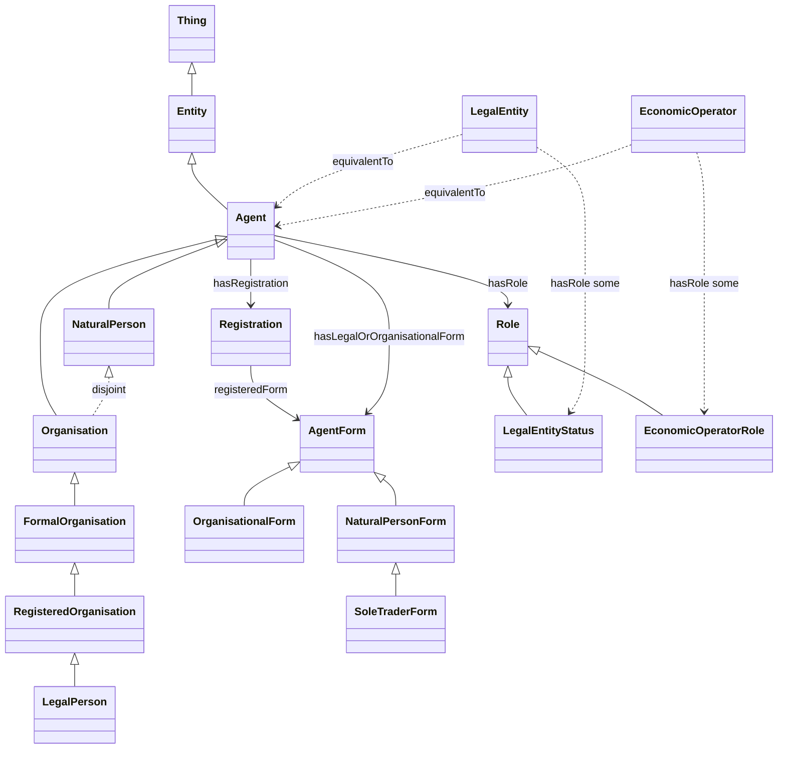

# Agent Ontology Structure (with registration-based legal/organisational form)

## Core structure (key additions)

- **Thing**
  - **Entity**
    - **Agent** (Actor): an Entity capable of acting.

### Kind-of-agent axis (kept separate)
- **NaturalPerson** ⊑ Agent  
- **Organisation** ⊑ Agent  
- `NaturalPerson` **disjointWith** `Organisation`

### Organisation refinement
- **FormalOrganisation** ⊑ Organisation  
- **RegisteredOrganisation** ⊑ FormalOrganisation  

### Registration and form classification (new feature)
Registration (especially for organisations) typically includes a **classification of the agent into a legal/organisational form** (e.g., “limited liability company”, “public limited company”, “association”). Comparable forms may also exist for natural persons (e.g., “sole trader / proprietor”).

To represent this cleanly:
- **Registration** is a record/event associated with an Agent (typically a RegisteredOrganisation, but not limited to it).
- **AgentForm** is a classification concept used to type the legal/organisational form of an Agent.
  - **OrganisationalForm** ⊑ AgentForm (forms primarily used for organisations)
  - **NaturalPersonForm** ⊑ AgentForm (forms applicable to natural persons)
    - **SoleTraderForm** ⊑ NaturalPersonForm (example)

Key properties:
- `hasRegistration` : Agent → Registration
- `registeredForm` : Registration → AgentForm  
  (the form as recorded in the registration event/record)
- `hasLegalOrOrganisationalForm` : Agent → AgentForm  
  (a convenience projection; can be inferred from `hasRegistration/registeredForm`)

### Legalistic and economic operator dimensions (kept orthogonal)
- **Role**
  - **LegalEntityStatus** ⊑ Role
  - **EconomicOperatorRole** ⊑ Role
- **LegalEntity** ≡ Agent AND (hasRole SOME LegalEntityStatus)
- **EconomicOperator** ≡ Agent AND (hasRole SOME EconomicOperatorRole)

## Mermaid diagram

