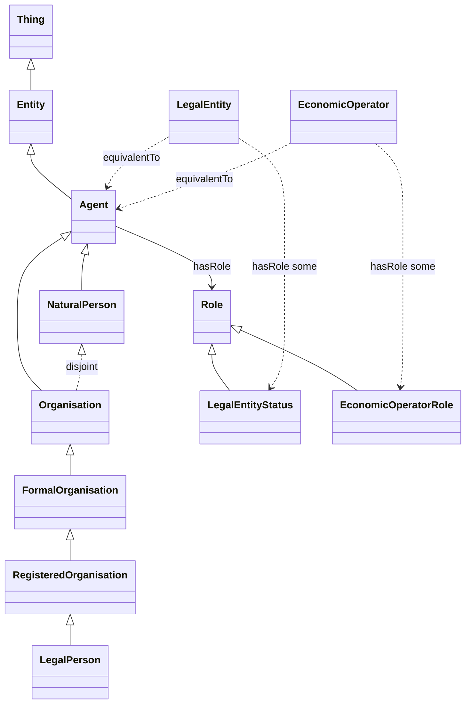

```mermaid
classDiagram
direction TB

class Thing
class Entity
class Agent

Thing <|-- Entity
Entity <|-- Agent

%% Kind-of-agent axis
class NaturalPerson
class Organisation
Agent <|-- NaturalPerson
Agent <|-- Organisation
NaturalPerson <|.. Organisation : disjoint

%% Organisation refinement
class FormalOrganisation
class RegisteredOrganisation
Organisation <|-- FormalOrganisation
FormalOrganisation <|-- RegisteredOrganisation

%% Legal person
class LegalPerson
RegisteredOrganisation <|-- LegalPerson

%% Role/status pattern
class Role
class LegalEntityStatus
class EconomicOperatorRole
Role <|-- LegalEntityStatus
Role <|-- EconomicOperatorRole

%% Defined classifications
class LegalEntity
class EconomicOperator

Agent --> Role : hasRole

LegalEntity ..> Agent : equivalentTo
LegalEntity ..> LegalEntityStatus : hasRole some

EconomicOperator ..> Agent : equivalentTo
EconomicOperator ..> EconomicOperatorRole : hasRole some
```