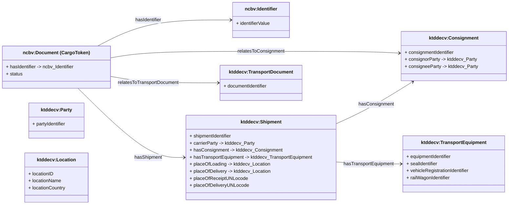

# Cargo Token – Class Diagram (GitHub-safe Mermaid)

This document contains a **GitHub-renderable Mermaid class diagram** for the Cargo Token concept,
modelled strictly using **NCBV** and **KTDDE** classes and properties.

⚠️ Note: Relationship labels have been made Mermaid-safe (no namespace colons, no cardinalities)
to avoid GitHub parsing errors. The original ontology IRIs are preserved in class titles.

---

---

## Implementation note

This diagram is intended for **conceptual documentation** in GitHub.
Cardinalities, datatypes, and full IRIs should be expressed in:
- OWL (ontology files)
- SHACL shapes
- JSON-LD contexts

not inside Mermaid diagrams.
