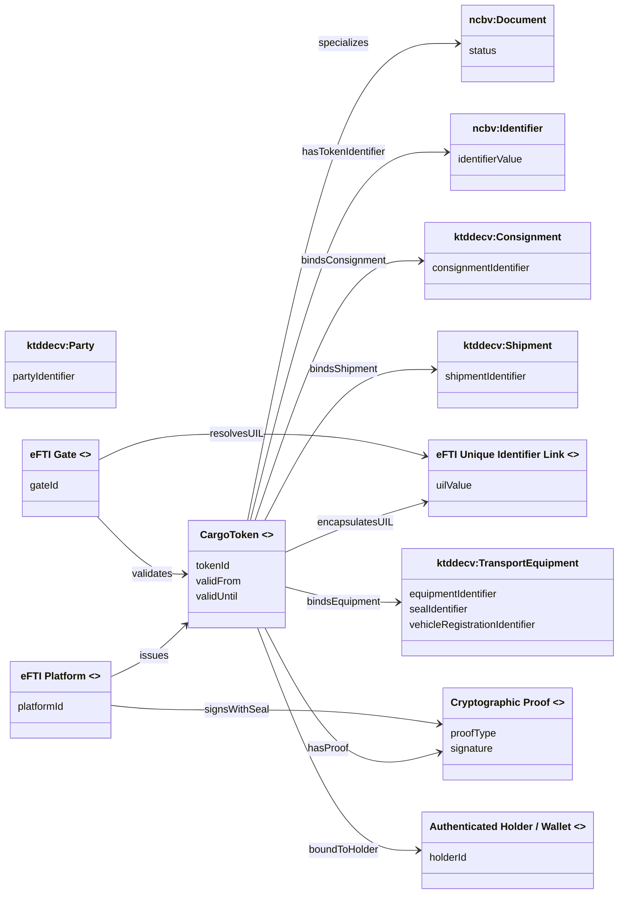

# Cargo Token – Extended Conceptual Model (eFTI / EUDI Wallet)

This document presents an **extended Mermaid class diagram** for the proposed **Cargo Token**
concept, based on a close reading of the draft email discussion.

The diagram:
- Reuses **existing concepts from NCBV and KTDDE** where possible
- **Explicitly introduces NEW concepts** that are **not present** in NCBV or KTDDE but are
  required to satisfy the functional, technical, and governance requirements described
  in the email (eFTI, EUDI Wallets, offline verification).

NEW concepts are clearly marked with `<<NEW>>`.

---

---

## Interpretation notes

- **CargoToken** is a verifiable control artifact that binds a physical consignment
  to its authoritative eFTI dataset via the **UIL**.
- The **eFTI Platform** is responsible for issuing and sealing the token.
- The **eFTI Gate** validates the token and resolves the UIL when online access is possible.
- Offline verification is enabled through the **cryptographic proof** embedded in the token.
- The underlying eFTI dataset and KTDDE documents remain the authoritative sources of data.

This file is intended for publication directly in GitHub; the Mermaid diagram is
GitHub-renderer safe.
