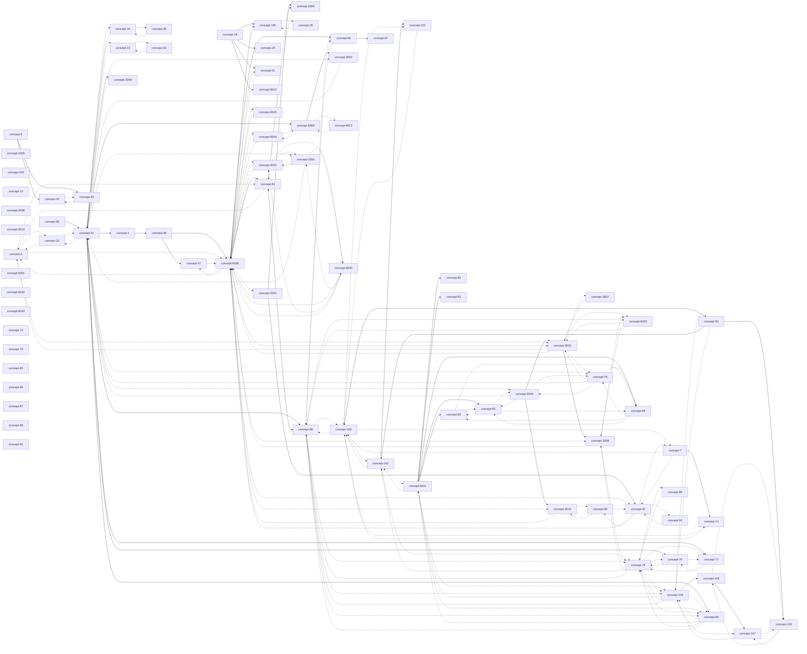

# WE BUILD Terminology (SKOS) — Concept Relationship Diagram

This file was generated from the Turtle source: `WE BUILD Terminology.ttl`.

## Overview

- Concepts found: **82**
- Hierarchical links (skos:broader / skos:narrower): **37**
- Associative links (skos:related, unique undirected pairs): **75**

## Complete Mermaid diagram

