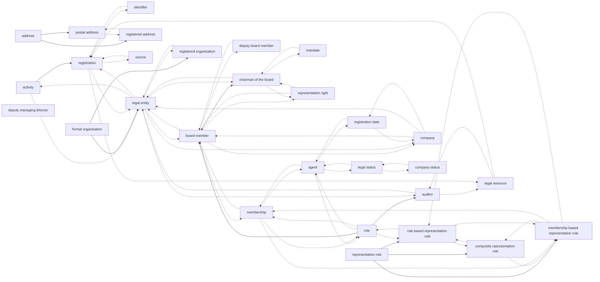
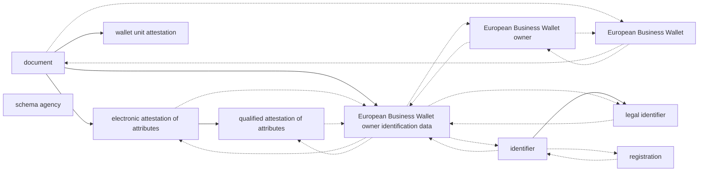
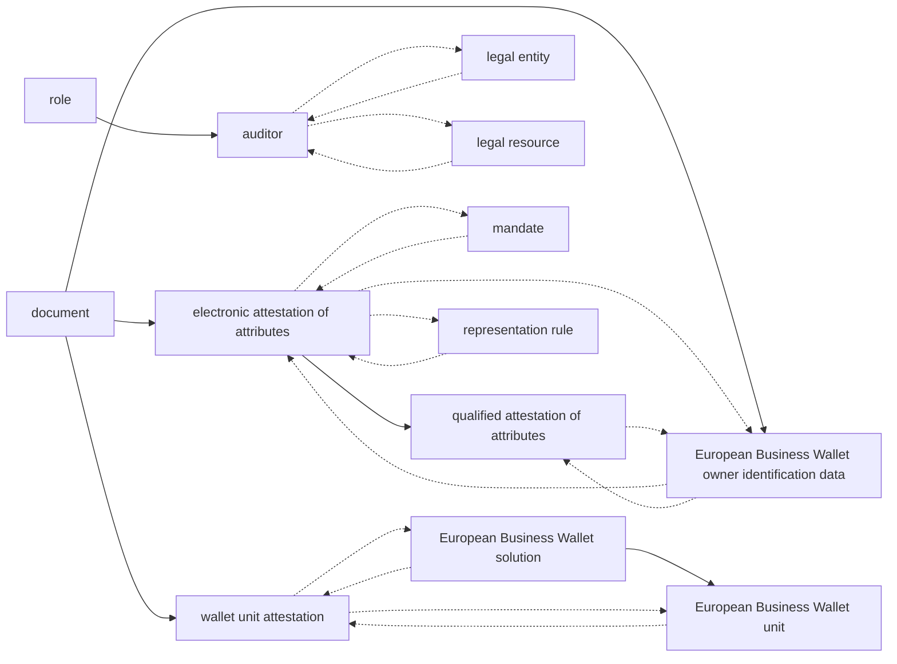
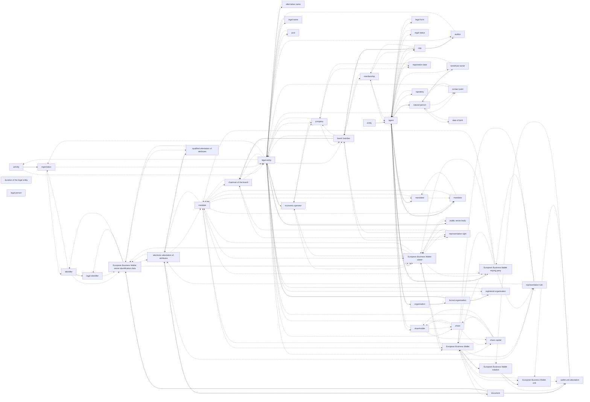
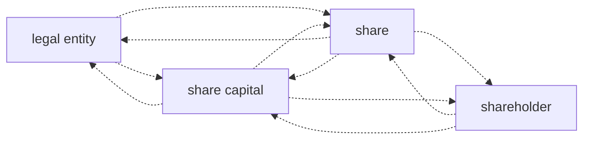
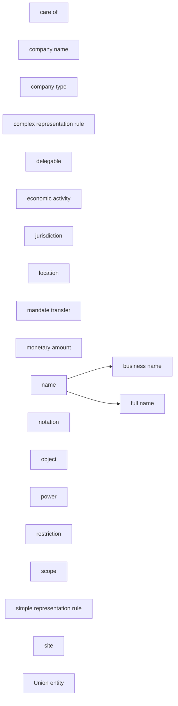

# WE BUILD Terminology (SKOS) — Thematic Concept Diagrams

Source: `WE BUILD Terminology.ttl`

Node labels are taken from the Turtle file via **`skos:prefLabel` pointing to a SKOS-XL label resource**, using **`skos-xl:literalForm` (English where available)**.

## Thematic split (heuristic)
The diagrams are grouped into the following themes (keyword-based, for navigation).

## Contents
- [Governance](#governance)
- [Data spaces](#data-spaces)
- [Trust and assurance](#trust-and-assurance)
- [Wallets and digital identity](#wallets-and-digital-identity)
- [Interoperability and architecture](#interoperability-and-architecture)
- [Other / cross-cutting](#other-cross-cutting)
- [Cross-cutting links](#cross-cutting-links)

## Governance

- Concepts included: **29**

## Data spaces

- Concepts included: **11**

## Trust and assurance

- Concepts included: **13**

## Wallets and digital identity

- Concepts included: **49**

## Interoperability and architecture

- Concepts included: **4**

## Other / cross-cutting

- Concepts included: **21**

## Cross-cutting links

Relationships where the two concepts fall under different *primary* themes.

| Theme A | Theme B | Concept A | Relationship | Concept B |
|---|---|---|---|---|
| Data spaces | Governance | electronic attestation of attributes | related | mandate |
| Data spaces | Governance | electronic attestation of attributes | related | representation rule |
| Data spaces | Governance | European Business Wallet | related | mandate |
| Data spaces | Governance | European Business Wallet | related | representation rule |
| Data spaces | Governance | European Business Wallet owner identification data | related | identifier |
| Data spaces | Trust and assurance | European Business Wallet | broader/narrower | European Business Wallet solution |
| Data spaces | Trust and assurance | European Business Wallet | related | European Business Wallet unit |
| Data spaces | Trust and assurance | wallet unit attestation | related | European Business Wallet solution |
| Data spaces | Trust and assurance | wallet unit attestation | related | European Business Wallet unit |
| Data spaces | Wallets and digital identity | European Business Wallet | related | European Business Wallet relying party |
| Data spaces | Wallets and digital identity | European Business Wallet owner | related | European Business Wallet relying party |
| Governance | Data spaces | agent | broader/narrower | European Business Wallet owner |
| Governance | Data spaces | identifier | broader/narrower | legal identifier |
| Governance | Data spaces | mandate | related | European Business Wallet owner |
| Governance | Data spaces | representation right | related | European Business Wallet owner |
| Governance | Other / cross-cutting | activity | broader/narrower | economic activity |
| Governance | Other / cross-cutting | mandate | related | mandate transfer |
| Governance | Other / cross-cutting | representation rule | broader/narrower | complex representation rule |
| Governance | Other / cross-cutting | representation rule | broader/narrower | simple representation rule |
| Governance | Wallets and digital identity | agent | broader/narrower | European Business Wallet relying party |
| Governance | Wallets and digital identity | agent | broader/narrower | mandatee |
| Governance | Wallets and digital identity | agent | broader/narrower | mandator |
| Governance | Wallets and digital identity | agent | broader/narrower | natural person |
| Governance | Wallets and digital identity | agent | broader/narrower | organisation |
| Governance | Wallets and digital identity | company | related | economic operator |
| Governance | Wallets and digital identity | legal entity | related | contact point |
| Governance | Wallets and digital identity | legal entity | broader/narrower | economic operator |
| Governance | Wallets and digital identity | legal entity | related | post |
| Governance | Wallets and digital identity | legal entity | broader/narrower | public sector body |
| Governance | Wallets and digital identity | legal entity | related | share capital |
| Governance | Wallets and digital identity | mandate | related | European Business Wallet relying party |
| Governance | Wallets and digital identity | mandate | related | mandatee |
| Governance | Wallets and digital identity | mandate | related | mandator |
| Governance | Wallets and digital identity | representation rule | related | European Business Wallet relying party |
| Other / cross-cutting | Wallets and digital identity | economic activity | related | economic operator |
| Other / cross-cutting | Wallets and digital identity | name | broader/narrower | alternative name |
| Other / cross-cutting | Wallets and digital identity | name | broader/narrower | legal name |
| Wallets and digital identity | Data spaces | economic operator | related | European Business Wallet owner |
| Wallets and digital identity | Data spaces | public sector body | related | European Business Wallet owner |
| Wallets and digital identity | Governance | alternative name | related | legal entity |
| Wallets and digital identity | Governance | beneficial owner | related | agent |
| Wallets and digital identity | Governance | entity | broader/narrower | agent |
| Wallets and digital identity | Governance | legal form | related | agent |
| Wallets and digital identity | Governance | legal name | related | legal entity |
| Wallets and digital identity | Governance | organisation | broader/narrower | formal organisation |
| Wallets and digital identity | Governance | share | related | legal entity |
| Wallets and digital identity | Governance | shareholder | related | agent |
| Wallets and digital identity | Governance | signatory | related | agent |
| Wallets and digital identity | Other / cross-cutting | legal form | related | company type |
| Wallets and digital identity | Other / cross-cutting | legal name | related | company name |
| Wallets and digital identity | Other / cross-cutting | public sector body | broader/narrower | Union entity |

> Note: If you want a stricter thematic split, the most robust method is to anchor themes on specific top concepts and take their narrower closure (once the hierarchy is final).