# WE BUILD Terminology (SKOS) — Diagrams by Top Concept

Source: `WE BUILD Terminology.ttl`

Node labels come from **SKOS-XL** (`skos:prefLabel` → label resource → `skos-xl:literalForm`, English where available).

Conventions in diagrams:
- **Hierarchy:** solid arrows labeled **narrower** (top → down) and **broader** (child → up).
- **Related:** dotted arrows (less prominent).

## Index
- [activity](#activity)
- [address](#address)
- [care of](#care-of)
- [company](#company)
- [company name](#company-name)
- [company status](#company-status)
- [company type](#company-type)
- [contact point](#contact-point)
- [date of birth](#date-of-birth)
- [delegable](#delegable)
- [deputy board member](#deputy-board-member)
- [deputy managing director](#deputy-managing-director)
- [document](#document)
- [duration of the legal entity](#duration-of-the-legal-entity)
- [entity](#entity)
- [European Business Wallet](#european-business-wallet)
- [identifier](#identifier)
- [jurisdiction](#jurisdiction)
- [legal form](#legal-form)
- [legal person](#legal-person)
- [legal resource](#legal-resource)
- [legal status](#legal-status)
- [location](#location)
- [mandate](#mandate)
- [mandate transfer](#mandate-transfer)
- [membership](#membership)
- [monetary amount](#monetary-amount)
- [name](#name)
- [notation](#notation)
- [object](#object)
- [post](#post)
- [power](#power)
- [registration date](#registration-date)
- [representation right](#representation-right)
- [representation rule](#representation-rule)
- [restriction](#restriction)
- [role](#role)
- [schema agency](#schema-agency)
- [scope](#scope)
- [share](#share)
- [share capital](#share-capital)
- [shareholder](#shareholder)
- [signatory](#signatory)
- [site](#site)
- [source](#source)

## activity

- Concepts in subtree (narrower closure): **3**
- Hierarchy links in subtree: **2**
- Related links in subtree: **0**

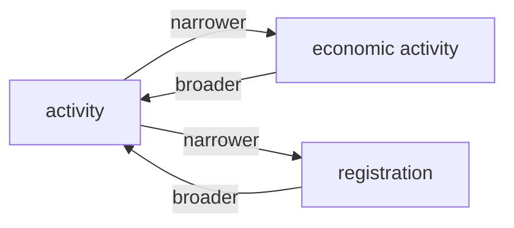

## address

- Concepts in subtree (narrower closure): **3**
- Hierarchy links in subtree: **2**
- Related links in subtree: **1**

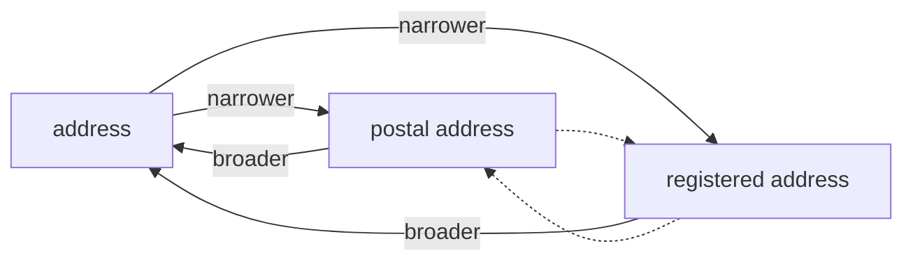

## care of

- Concepts in subtree (narrower closure): **1**
- Hierarchy links in subtree: **0**
- Related links in subtree: **0**


## company

- Concepts in subtree (narrower closure): **1**
- Hierarchy links in subtree: **0**
- Related links in subtree: **0**


## company name

- Concepts in subtree (narrower closure): **1**
- Hierarchy links in subtree: **0**
- Related links in subtree: **0**


## company status

- Concepts in subtree (narrower closure): **1**
- Hierarchy links in subtree: **0**
- Related links in subtree: **0**

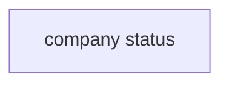

## company type

- Concepts in subtree (narrower closure): **1**
- Hierarchy links in subtree: **0**
- Related links in subtree: **0**

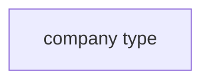

## contact point

- Concepts in subtree (narrower closure): **1**
- Hierarchy links in subtree: **0**
- Related links in subtree: **0**


## date of birth

- Concepts in subtree (narrower closure): **1**
- Hierarchy links in subtree: **0**
- Related links in subtree: **0**


## delegable

- Concepts in subtree (narrower closure): **1**
- Hierarchy links in subtree: **0**
- Related links in subtree: **0**


## deputy board member

- Concepts in subtree (narrower closure): **1**
- Hierarchy links in subtree: **0**
- Related links in subtree: **0**

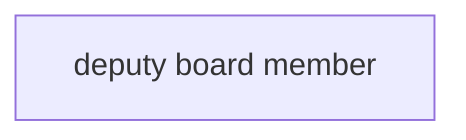

## deputy managing director

- Concepts in subtree (narrower closure): **1**
- Hierarchy links in subtree: **0**
- Related links in subtree: **0**

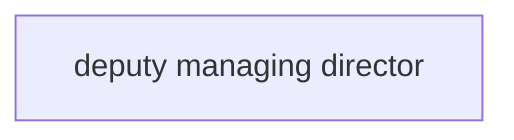

## document

- Concepts in subtree (narrower closure): **5**
- Hierarchy links in subtree: **4**
- Related links in subtree: **2**

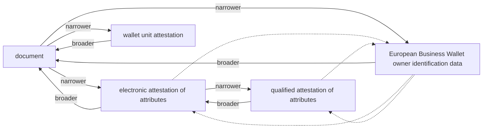

## duration of the legal entity

- Concepts in subtree (narrower closure): **1**
- Hierarchy links in subtree: **0**
- Related links in subtree: **0**

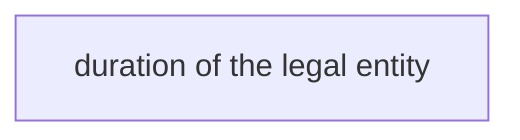

## entity

- Concepts in subtree (narrower closure): **15**
- Hierarchy links in subtree: **14**
- Related links in subtree: **6**

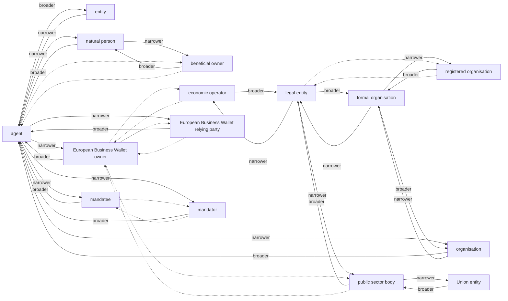

## European Business Wallet

- Concepts in subtree (narrower closure): **3**
- Hierarchy links in subtree: **2**
- Related links in subtree: **1**

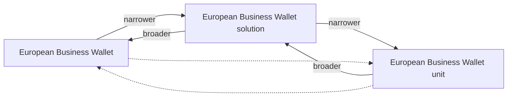

## identifier

- Concepts in subtree (narrower closure): **2**
- Hierarchy links in subtree: **1**
- Related links in subtree: **0**

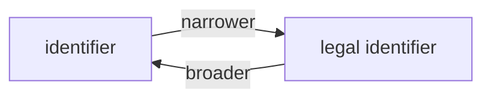

## jurisdiction

- Concepts in subtree (narrower closure): **1**
- Hierarchy links in subtree: **0**
- Related links in subtree: **0**


## legal form

- Concepts in subtree (narrower closure): **1**
- Hierarchy links in subtree: **0**
- Related links in subtree: **0**

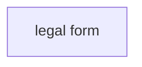

## legal person

- Concepts in subtree (narrower closure): **1**
- Hierarchy links in subtree: **0**
- Related links in subtree: **0**


## legal resource

- Concepts in subtree (narrower closure): **1**
- Hierarchy links in subtree: **0**
- Related links in subtree: **0**

```mermaid
flowchart LR
  N001["legal resource"]
```

## legal status

- Concepts in subtree (narrower closure): **1**
- Hierarchy links in subtree: **0**
- Related links in subtree: **0**

```mermaid
flowchart LR
  N001["legal status"]
```

## location

- Concepts in subtree (narrower closure): **1**
- Hierarchy links in subtree: **0**
- Related links in subtree: **0**

```mermaid
flowchart LR
  N001["location"]
```

## mandate

- Concepts in subtree (narrower closure): **1**
- Hierarchy links in subtree: **0**
- Related links in subtree: **0**

```mermaid
flowchart LR
  N001["mandate"]
```

## mandate transfer

- Concepts in subtree (narrower closure): **1**
- Hierarchy links in subtree: **0**
- Related links in subtree: **0**

```mermaid
flowchart LR
  N001["mandate transfer"]
```

## membership

- Concepts in subtree (narrower closure): **1**
- Hierarchy links in subtree: **0**
- Related links in subtree: **0**

```mermaid
flowchart LR
  N001["membership"]
```

## monetary amount

- Concepts in subtree (narrower closure): **1**
- Hierarchy links in subtree: **0**
- Related links in subtree: **0**

```mermaid
flowchart LR
  N001["monetary amount"]
```

## name

- Concepts in subtree (narrower closure): **5**
- Hierarchy links in subtree: **4**
- Related links in subtree: **0**

```mermaid
flowchart LR
  N001["alternative name"]
  N002["business name"]
  N003["full name"]
  N004["legal name"]
  N005["name"]
  N005 -->|narrower| N001
  N001 -->|broader| N005
  N005 -->|narrower| N002
  N002 -->|broader| N005
  N005 -->|narrower| N003
  N003 -->|broader| N005
  N005 -->|narrower| N004
  N004 -->|broader| N005
```

## notation

- Concepts in subtree (narrower closure): **1**
- Hierarchy links in subtree: **0**
- Related links in subtree: **0**

```mermaid
flowchart LR
  N001["notation"]
```

## object

- Concepts in subtree (narrower closure): **1**
- Hierarchy links in subtree: **0**
- Related links in subtree: **0**

```mermaid
flowchart LR
  N001["object"]
```

## post

- Concepts in subtree (narrower closure): **1**
- Hierarchy links in subtree: **0**
- Related links in subtree: **0**

```mermaid
flowchart LR
  N001["post"]
```

## power

- Concepts in subtree (narrower closure): **1**
- Hierarchy links in subtree: **0**
- Related links in subtree: **0**

```mermaid
flowchart LR
  N001["power"]
```

## registration date

- Concepts in subtree (narrower closure): **1**
- Hierarchy links in subtree: **0**
- Related links in subtree: **0**

```mermaid
flowchart LR
  N001["registration date"]
```

## representation right

- Concepts in subtree (narrower closure): **1**
- Hierarchy links in subtree: **0**
- Related links in subtree: **0**

```mermaid
flowchart LR
  N001["representation right"]
```

## representation rule

- Concepts in subtree (narrower closure): **6**
- Hierarchy links in subtree: **5**
- Related links in subtree: **3**

```mermaid
flowchart LR
  N001["complex representation rule"]
  N002["composite representation rule"]
  N003["membership based representation rule"]
  N004["representation rule"]
  N005["role based representation rule"]
  N006["simple representation rule"]
  N004 -->|narrower| N001
  N001 -->|broader| N004
  N004 -->|narrower| N002
  N002 -->|broader| N004
  N004 -->|narrower| N003
  N003 -->|broader| N004
  N004 -->|narrower| N005
  N005 -->|broader| N004
  N004 -->|narrower| N006
  N006 -->|broader| N004
  N002 -.-> N003
  N003 -.-> N002
  N002 -.-> N005
  N005 -.-> N002
  N005 -.-> N003
  N003 -.-> N005
```

## restriction

- Concepts in subtree (narrower closure): **1**
- Hierarchy links in subtree: **0**
- Related links in subtree: **0**

```mermaid
flowchart LR
  N001["restriction"]
```

## role

- Concepts in subtree (narrower closure): **4**
- Hierarchy links in subtree: **3**
- Related links in subtree: **0**

```mermaid
flowchart LR
  N001["auditor"]
  N002["board member"]
  N003["chairman of the board"]
  N004["role"]
  N002 -->|narrower| N003
  N003 -->|broader| N002
  N004 -->|narrower| N001
  N001 -->|broader| N004
  N004 -->|narrower| N002
  N002 -->|broader| N004
```

## schema agency

- Concepts in subtree (narrower closure): **1**
- Hierarchy links in subtree: **0**
- Related links in subtree: **0**

```mermaid
flowchart LR
  N001["schema agency"]
```

## scope

- Concepts in subtree (narrower closure): **1**
- Hierarchy links in subtree: **0**
- Related links in subtree: **0**

```mermaid
flowchart LR
  N001["scope"]
```

## share

- Concepts in subtree (narrower closure): **1**
- Hierarchy links in subtree: **0**
- Related links in subtree: **0**

```mermaid
flowchart LR
  N001["share"]
```

## share capital

- Concepts in subtree (narrower closure): **1**
- Hierarchy links in subtree: **0**
- Related links in subtree: **0**

```mermaid
flowchart LR
  N001["share capital"]
```

## shareholder

- Concepts in subtree (narrower closure): **1**
- Hierarchy links in subtree: **0**
- Related links in subtree: **0**

```mermaid
flowchart LR
  N001["shareholder"]
```

## signatory

- Concepts in subtree (narrower closure): **1**
- Hierarchy links in subtree: **0**
- Related links in subtree: **0**

```mermaid
flowchart LR
  N001["signatory"]
```

## site

- Concepts in subtree (narrower closure): **1**
- Hierarchy links in subtree: **0**
- Related links in subtree: **0**

```mermaid
flowchart LR
  N001["site"]
```

## source

- Concepts in subtree (narrower closure): **1**
- Hierarchy links in subtree: **0**
- Related links in subtree: **0**

```mermaid
flowchart LR
  N001["source"]
```
