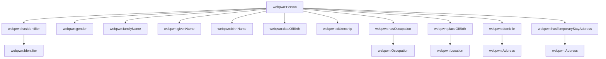
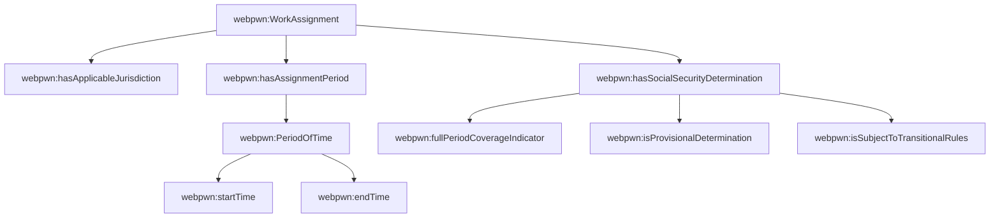
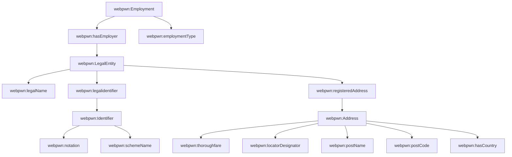
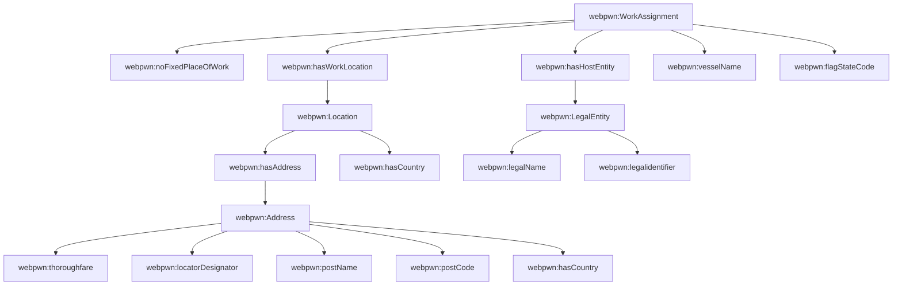
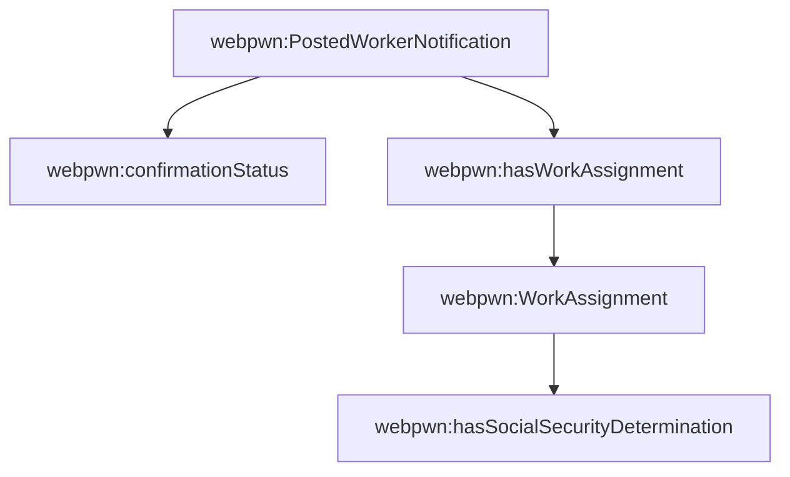
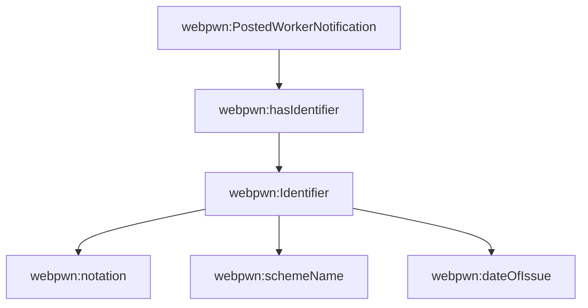
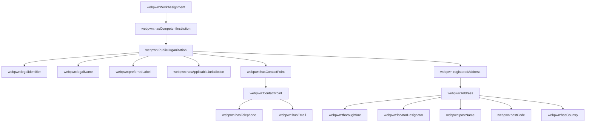

# Posted Worker Notification (PWN) – Accurate SHACL Mapping

This Markdown document provides a more accurate, GitHub-ready explanation of the **Posted Worker Notification (PWN)** SHACL data model. 
It is structured according to the logical parts of the attestation and aligns each section with the **actual `webpwn:` NodeShapes and PropertyShapes found in the uploaded Turtle file**.

The mappings below therefore use the SHACL property names as they appear in the model, including for example:

- `webpwn:isProvisionalDetermination`
- `webpwn:isSubjectToTransitionalRules`
- `webpwn:fullPeriodCoverageIndicator`
- `webpwn:confirmationStatus`

Where the SHACL shape does **not** provide a one-to-one match for a form element, that is stated explicitly in the table.

## Table of Contents

- [1. Subject](#1-subject)
- [2. Assignment related information](#2-assignment-related-information)
- [3. Details of Employer(s)/Self-employment](#3-details-of-employer-s-self-employment)
- [4. Place(s) of work](#4-place-s-of-work)
- [5. Status confirmation](#5-status-confirmation)
- [6. Unique Number of Issued Document (Credential)](#6-unique-number-of-issued-document-credential)
- [7. Competent Institution](#7-competent-institution)

## 1. Subject

### Section overview

This section models the posted worker as a **`webpwn:Person`**. The shape reuses EU Core and WE BUILD aligned properties for personal identity, birth data, citizenship, occupation, and two address patterns: domicile and temporary stay.

### Visual model

### Main SHACL nodes used in this section

| SHACL NodeShape | Label | Target class |
|---|---|---|
| `webpwn:Person` | Person | `eu-core:Person` |
| `webpwn:Identifier` | Identifier | `eu-core:Identifier` |
| `webpwn:Occupation` | Occupation | `webuild:Occupation` |
| `webpwn:Location` | Location | `eu-core:Location` |
| `webpwn:Address` | Address | `eu-core:Address` |
| `webpwn:Jurisdiction` | Jurisdiction | `eu-core:Jurisdiction` |
| `webpwn:Country` | Country | `webuild:Country` |

### Property-level mapping to original attestation elements

| Original attestation element | SHACL node | SHACL property | SHACL label | `sh:path` | Range / datatype | Expert note |
|---|---|---|---|---|---|---|
| `1.1 PIN` | `webpwn:Person` | `webpwn:hasIdentifier` | has identifier | `ncbv:hasIdentifier` | `eu-core:Identifier` | Personal identification number should be carried via an Identifier node. |
| `1.2 Gender` | `webpwn:Person` | `webpwn:gender` | Gender | `eu-core:gender` | `"http://www.w3.org/2001/XMLSchema#string"` | Gender is modelled as a literal string in the current SHACL. |
| `1.3 Familyname(s)` | `webpwn:Person` | `webpwn:familyName` | Family name | `eu-core:familyName` | `"http://www.w3.org/2001/XMLSchema#string"` | Family name of the worker. |
| `1.4 Forename(s)` | `webpwn:Person` | `webpwn:givenName` | Given name | `eu-core:givenName` | `"http://www.w3.org/2001/XMLSchema#string"` | Given name(s) of the worker. |
| `1.5 Surname at birth` | `webpwn:Person` | `webpwn:birthName` | Birth Name | `eu-core:birthName` | `"http://www.w3.org/2001/XMLSchema#string"` | Birth name is explicitly available. |
| `1.6 Forename(s) at birth` | `webpwn:Person` | `webpwn:birthName` | Birth Name | `eu-core:birthName` | `"http://www.w3.org/2001/XMLSchema#string"` | The current shape has only one Birth Name field, so forename-at-birth is not separately distinguished. |
| `1.7 Date of Birth` | `webpwn:Person` | `webpwn:dateOfBirth` | Date of Birth | `eu-core:dateOfBirth` | `"http://www.w3.org/2001/XMLSchema#date"` | Birth date as xsd:date. |
| `1.8 Nationality` | `webpwn:Person` | `webpwn:citizenship` | citizenship | `eu-core:citizenship` | `eu-core:Jurisdiction` | Citizenship is linked to a Jurisdiction node rather than directly to a Country literal. |
| `1.9 Job Title in Home Country` | `webpwn:Person` | `webpwn:hasOccupation` | has occupation | `webuild:hasOccupation` | `webuild:Occupation` | Occupation is represented through a linked Occupation node. |
| `1.9 Place of Birth` | `webpwn:Person` | `webpwn:placeOfBirth` | place of birth | `eu-core:placeOfBirth` | `eu-core:Location` | Birth place is represented as a Location node. |
| `1.10.1 Address in the state of residence` | `webpwn:Person` | `webpwn:domicile` | domicile | `eu-core:domicile` | `eu-core:Address` | Residence address is mapped through domicile. |
| `1.10.2 Address in the state of stay` | `webpwn:Person` | `webpwn:hasTemporaryStayAddress` | has temporary stay address | `webuild:hasTemporaryStayAddress` | `eu-core:Address` | Temporary stay address is explicitly represented. |

### Original Excel data elements in this section

| Original element | Description |
|---|---|
| `1.1 PIN` | Personal Identification Number/ ID number |
| `1.2 Gender` |  |
| `1.3 Familyname(s)` |  |
| `1.4 Forename(s)` |  |
| `1.5 Surname at birth` |  |
| `1.6 Forename(s) at birth` |  |
| `1.7 Date of Birth` |  |
| `1.8 Nationality` |  |
| `1.9 Job Title in Home Country` |  |
| `1.9 Place of Birth` |  |
| `1.9.1 Town` |  |
| `1.9.2 Country code` |  |
| `1.10 Address` |  |
| `1.10.1 Address in the state of residence` |  |
| `1.10.1.1 Street, N°` |  |
| `1.10.1.2 Town` |  |
| `1.10.1.3 Post code` |  |
| `1.10.1.4 Country code` |  |
| `1.10.2 Address in the state of stay` |  |
| `1.10.2.1 Street, N°` |  |
| `1.10.2.2 Town` |  |
| `1.10.2.3 Post code` |  |
| `1.10.2.4 Country code` |  |

[Back to Top](#table-of-contents)

---

## 2. Assignment related information

### Section overview

This section belongs mainly to **`webpwn:WorkAssignment`** and **`webpwn:SocialSecurityDetermination`**. It captures the applicable jurisdiction, the posting period, and the legal determination flags that are essential in posted-worker and A1-style social-security logic.

### Visual model

### Main SHACL nodes used in this section

| SHACL NodeShape | Label | Target class |
|---|---|---|
| `webpwn:WorkAssignment` | Work Assignment | `webuild:WorkAssignment` |
| `webpwn:PeriodOfTime` | Period of Time | `eu-core:PeriodOfTime` |
| `webpwn:SocialSecurityDetermination` | Social Security Determination | `webuild:SocialSecurityDetermination` |
| `webpwn:Jurisdiction` | Jurisdiction | `eu-core:Jurisdiction` |

### Property-level mapping to original attestation elements

| Original attestation element | SHACL node | SHACL property | SHACL label | `sh:path` | Range / datatype | Expert note |
|---|---|---|---|---|---|---|
| `2.1 Home Member state` | `webpwn:WorkAssignment` | `webpwn:hasApplicableJurisdiction` | has applicable jurisdiction  | `webuild:hasApplicableJurisdiction` | `eu-core:Jurisdiction` | Home Member State is modelled via an applicable jurisdiction node. |
| `2.2 Starting date` | `webpwn:PeriodOfTime` | `webpwn:startTime` | Start time | `eu-core:startTime` | `"http://www.w3.org/2001/XMLSchema#dateTime"` | Assignment start is carried in the PeriodOfTime node. |
| `2.3 Ending date` | `webpwn:PeriodOfTime` | `webpwn:endTime` | End time | `eu-core:endTime` | `"http://www.w3.org/2001/XMLSchema#dateTime"` | Assignment end is carried in the PeriodOfTime node. |
| `2.4 Certificate applies for the duration of the activity` | `webpwn:SocialSecurityDetermination` | `webpwn:fullPeriodCoverageIndicator` | Full Period Coverage Indicator | `webuild:fullPeriodCoverageIndicator` | `"http://www.w3.org/2001/XMLSchema#boolean"` | Boolean indicator for full-period coverage. |
| `2.5 Determination is provisional` | `webpwn:SocialSecurityDetermination` | `webpwn:isProvisionalDetermination` | Is Provisional Determination | `webuild:isProvisionalDetermination` | `"http://www.w3.org/2001/XMLSchema#boolean"` | Exact SHACL property name in the TTL. |
| `2.6 Transitional rules apply` | `webpwn:SocialSecurityDetermination` | `webpwn:isSubjectToTransitionalRules` | Is Subject To Transitional Rules | `webuild:isSubjectToTransitionalRules` | `"http://www.w3.org/2001/XMLSchema#boolean"` | Exact SHACL property name in the TTL. |

### Original Excel data elements in this section

| Original element | Description |
|---|---|
| `2.1 Home Member state` |  |
| `2.2 Starting date` |  |
| `2.3 Ending date` |  |
| `2.4 Certificate applies for the duration of the activity` |  |
| `2.5 Determination is provisional` |  |
| `2.6 Transitional rules apply` |  |

[Back to Top](#table-of-contents)

---

## 3. Details of Employer(s)/Self-employment

### Section overview

This section is split between **`webpwn:Employment`** and **`webpwn:LegalEntity`**. The employment relation links worker and employer, while the employer legal entity carries identifier, legal name, activity, representatives, contact point, and registered address.

### Visual model

### Main SHACL nodes used in this section

| SHACL NodeShape | Label | Target class |
|---|---|---|
| `webpwn:Employment` | Employment | `webuild:Employment` |
| `webpwn:LegalEntity` | Legal Entity | `eu-core:LegalEntity` |
| `webpwn:Identifier` | Identifier | `eu-core:Identifier` |
| `webpwn:Address` | Address | `eu-core:Address` |
| `webpwn:ContactPoint` | Contact Point | `eu-core:ContactPoint` |

### Property-level mapping to original attestation elements

| Original attestation element | SHACL node | SHACL property | SHACL label | `sh:path` | Range / datatype | Expert note |
|---|---|---|---|---|---|---|
| `3.1 Type of Employment (Temporary?)` | `webpwn:Employment` | `webpwn:employmentType` | employment type | `webuild:employmentType` | `skos:Concept` | Employment type is a SKOS concept-valued property. |
| `3.2 Name` | `webpwn:LegalEntity` | `webpwn:legalName` | Legal name | `eu-core:legalName` | `"http://www.w3.org/2001/XMLSchema#string"` | Employer legal name. |
| `3.3 EmployerID` | `webpwn:LegalEntity` | `webpwn:legalidentifier` | legal identifier | `eu-core:legalidentifier` | `eu-core:Identifier` | The Legal Entity shape uses legalidentifier rather than hasIdentifier. |
| `3.4 Type of ID` | `webpwn:Identifier` | `webpwn:schemeName` | Scheme name | `eu-core:schemeName` | `"http://www.w3.org/2001/XMLSchema#string"` | Identifier scheme metadata is carried on the Identifier node. |
| `3.5 Address` | `webpwn:LegalEntity` | `webpwn:registeredAddress` | registered address | `eu-core:registeredAddress` | `eu-core:Address` | Employer address is modelled as registeredAddress. |
| `3.5.1 Street, N°` | `webpwn:Address` | `webpwn:thoroughfare` / `webpwn:locatorDesignator` | Thoroughfare / Locator designator | `eu-core:thoroughfare` / `eu-core:locatorDesignator` |  /  | Street name and number are split at address level. |
| `3.5.2 Town` | `webpwn:Address` | `webpwn:postName` | Post name | `eu-core:postName` | `` | Town/locality. |
| `3.5.3 Post code` | `webpwn:Address` | `webpwn:postCode` | Post code | `eu-core:postCode` | `` | Postal code. |
| `3.5.4 Country code` | `webpwn:Address` | `webpwn:hasCountry` | has country | `webuild:hasCountry` | `webuild:Country` | Address links to a Country node. |

### Original Excel data elements in this section

| Original element | Description |
|---|---|
| `3.1 Type of Employment (Temporary?)` |  |
| `3.2 Name` |  |
| `3.3 EmployerID` |  |
| `3.4 Type of ID` |  |
| `3.5 Address` |  |
| `3.5.1 Street, N°` |  |
| `3.5.2 Town` |  |
| `3.5.3 Post code` |  |
| `3.5.4 Country code` |  |

[Back to Top](#table-of-contents)

---

## 4. Place(s) of work

### Section overview

This section is centred on **`webpwn:WorkAssignment`** and **`webpwn:Location`**. The shape supports both ordinary fixed worksites and more specialised vessel-related work contexts through dedicated flags and vessel metadata.

### Visual model

### Main SHACL nodes used in this section

| SHACL NodeShape | Label | Target class |
|---|---|---|
| `webpwn:WorkAssignment` | Work Assignment | `webuild:WorkAssignment` |
| `webpwn:Location` | Location | `eu-core:Location` |
| `webpwn:LegalEntity` | Legal Entity | `eu-core:LegalEntity` |
| `webpwn:Country` | Country | `webuild:Country` |
| `webpwn:Address` | Address | `eu-core:Address` |

### Property-level mapping to original attestation elements

| Original attestation element | SHACL node | SHACL property | SHACL label | `sh:path` | Range / datatype | Expert note |
|---|---|---|---|---|---|---|
| `4.1 No fixed place of work exists` | `webpwn:WorkAssignment` | `webpwn:noFixedPlaceOfWork` | No Fixed Place of Work | `webuild:noFixedPlaceOfWork` | `"http://www.w3.org/2001/XMLSchema#boolean"` | Boolean no-fixed-place indicator. |
| `4.1.1 Country code` | `webpwn:Location / webpwn:Address` | `webpwn:hasCountry` | has country | `webuild:hasCountry` | `webuild:Country` | Country can be linked at location or address level. |
| `4.2 Place of work` | `webpwn:WorkAssignment` | `webpwn:hasWorkLocation` | has work location | `webuild:hasWorkLocation` | `eu-core:Location` | Link from WorkAssignment to Location. |
| `4.2.1 Company/vessel name` | `webpwn:WorkAssignment / webpwn:LegalEntity` | `webpwn:vesselName` / `webpwn:legalName` | Vessel Name / Legal name | `webuild:vesselName` / `eu-core:legalName` |  / `"http://www.w3.org/2001/XMLSchema#string"` | The model distinguishes vesselName from legalName. |
| `4.2.2 Flag Base Home State` | `webpwn:WorkAssignment` | `webpwn:flagStateCode` | Flag State Code | `webuild:flagStateCode` | `"http://www.w3.org/2001/XMLSchema#string"` | Exact SHACL property for vessel-related flag state. |
| `4.2.3 CompanyID` | `webpwn:LegalEntity` | `webpwn:legalidentifier` | legal identifier | `eu-core:legalidentifier` | `eu-core:Identifier` | Host entity identifier. |
| `4.2.4 Type of ID` | `webpwn:Identifier` | `webpwn:schemeName` | Scheme name | `eu-core:schemeName` | `"http://www.w3.org/2001/XMLSchema#string"` | Identifier scheme metadata. |
| `4.2.5 Street, N°` | `webpwn:Address` | `webpwn:thoroughfare` / `webpwn:locatorDesignator` | Thoroughfare / Locator designator | `eu-core:thoroughfare` / `eu-core:locatorDesignator` |  /  | Street and number at address level. |
| `4.2.6 Town` | `webpwn:Address` | `webpwn:postName` | Post name | `eu-core:postName` | `` | Town/locality. |
| `4.2.7 Postal Code` | `webpwn:Address` | `webpwn:postCode` | Post code | `eu-core:postCode` | `` | Postal code. |
| `4.2.8 Country code` | `webpwn:Address` | `webpwn:hasCountry` | has country | `webuild:hasCountry` | `webuild:Country` | Country link for worksite address. |

### Original Excel data elements in this section

| Original element | Description |
|---|---|
| `4.1 No fixed place of work exists` |  |
| `4.1.1 Country code` |  |
| `4.2 Place of work` |  |
| `4.2.1 Company/vessel name` |  |
| `4.2.2 Flag Base Home State` |  |
| `4.2.3 CompanyID` |  |
| `4.2.4 Type of ID ` |  |
| `4.2.5 Street, N°` |  |
| `4.2.6 Town` |  |
| `4.2.7 Postal Code` |  |
| `4.2.8 Country code` |  |

[Back to Top](#table-of-contents)

---

## 5. Status confirmation

### Section overview

This section exists at two levels in the current model. At credential level, **`webpwn:PostedWorkerNotification`** has **`webpwn:confirmationStatus`**. At determination level, **`webpwn:SocialSecurityDetermination`** carries the finer legal qualifiers.

### Visual model

### Main SHACL nodes used in this section

| SHACL NodeShape | Label | Target class |
|---|---|---|
| `webpwn:PostedWorkerNotification` | Posted Worker Notification | `webuild:PostedWorkerNotification` |
| `webpwn:SocialSecurityDetermination` | Social Security Determination | `webuild:SocialSecurityDetermination` |

### Property-level mapping to original attestation elements

| Original attestation element | SHACL node | SHACL property | SHACL label | `sh:path` | Range / datatype | Expert note |
|---|---|---|---|---|---|---|
| `5.1 Status confirmation` | `webpwn:PostedWorkerNotification` | `webpwn:confirmationStatus` | confirmation status | `webuild:confirmationStatus` | `skos:Concept` | Credential-level confirmation status, range skos:Concept. |

### Original Excel data elements in this section

| Original element | Description |
|---|---|
| `5.1 Status confirmation` |  |

[Back to Top](#table-of-contents)

---

## 6. Unique Number of Issued Document (Credential)

### Section overview

This section is credential metadata. The **`webpwn:PostedWorkerNotification`** links to an Identifier node via **`webpwn:hasIdentifier`**, and the actual identifier value is carried in **`webpwn:notation`** on **`webpwn:Identifier`**.

### Visual model

### Main SHACL nodes used in this section

| SHACL NodeShape | Label | Target class |
|---|---|---|
| `webpwn:PostedWorkerNotification` | Posted Worker Notification | `webuild:PostedWorkerNotification` |
| `webpwn:Identifier` | Identifier | `eu-core:Identifier` |

### Property-level mapping to original attestation elements

| Original attestation element | SHACL node | SHACL property | SHACL label | `sh:path` | Range / datatype | Expert note |
|---|---|---|---|---|---|---|
| `6.1 Document ID` | `webpwn:PostedWorkerNotification` | `webpwn:hasIdentifier` | has identifier | `ncbv:hasIdentifier` | `eu-core:Identifier` | Links the credential to its Identifier node. |
| `6.1 Document ID` | `webpwn:Identifier` | `webpwn:notation` | Notation | `eu-core:notation` | `"http://www.w3.org/2001/XMLSchema#string"` | Actual document identifier value. |

### Original Excel data elements in this section

| Original element | Description |
|---|---|
| `6.1 Document ID` |  |

[Back to Top](#table-of-contents)

---

## 7. Competent Institution

### Section overview

This section uses **`webpwn:PublicOrganization`** and **`webpwn:ContactPoint`**. The institution is linked from the work assignment via **`webpwn:hasCompetentInstitution`** and has jurisdiction, identifier, legal name, contact details, and registered address.

### Visual model

### Main SHACL nodes used in this section

| SHACL NodeShape | Label | Target class |
|---|---|---|
| `webpwn:WorkAssignment` | Work Assignment | `webuild:WorkAssignment` |
| `webpwn:PublicOrganization` | Public Organization | `eu-core:PublicOrganization` |
| `webpwn:ContactPoint` | Contact Point | `eu-core:ContactPoint` |
| `webpwn:Address` | Address | `eu-core:Address` |
| `webpwn:Jurisdiction` | Jurisdiction | `eu-core:Jurisdiction` |

### Property-level mapping to original attestation elements

| Original attestation element | SHACL node | SHACL property | SHACL label | `sh:path` | Range / datatype | Expert note |
|---|---|---|---|---|---|---|
| `7.1 InstitutionID` | `webpwn:PublicOrganization` | `webpwn:legalidentifier` | legal identifier | `eu-core:legalidentifier` | `eu-core:Identifier` | Institution identifier. |
| `7.2 Institution Name` | `webpwn:PublicOrganization` | `webpwn:legalName` / `webpwn:preferredLabel` | Legal name / Preferred label | `eu-core:legalName` / `eu-core:preferredLabel` | `"http://www.w3.org/2001/XMLSchema#string"` /  | Current shape contains both legalName and preferredLabel. |
| `7.3 Country code` | `webpwn:PublicOrganization` | `webpwn:hasApplicableJurisdiction` | has applicable jurisdiction  | `webuild:hasApplicableJurisdiction` | `eu-core:Jurisdiction` | Institution country/jurisdiction link. |
| `7.4 Office fax N°` | `webpwn:ContactPoint` | — | — | — | — | The current ContactPoint shape has telephone and email, but no separate fax property. |
| `7.5 Office phone N°` | `webpwn:ContactPoint` | `webpwn:hasTelephone` | Has telephone | `eu-core:hasTelephone` | `"http://www.w3.org/2001/XMLSchema#string"` | Telephone. |
| `7.6 E-Mail` | `webpwn:ContactPoint` | `webpwn:hasEmail` | Has email | `eu-core:hasEmail` | `"http://www.w3.org/2001/XMLSchema#string"` | Email. |
| `7.7 Street, N°` | `webpwn:Address` | `webpwn:thoroughfare` / `webpwn:locatorDesignator` | Thoroughfare / Locator designator | `eu-core:thoroughfare` / `eu-core:locatorDesignator` |  /  | Street and number. |
| `7.8 Town` | `webpwn:Address` | `webpwn:postName` | Post name | `eu-core:postName` | `` | Town/locality. |
| `7.9 Postal Code` | `webpwn:Address` | `webpwn:postCode` | Post code | `eu-core:postCode` | `` | Postal code. |
| `7.10 Country code` | `webpwn:Address` | `webpwn:hasCountry` | has country | `webuild:hasCountry` | `webuild:Country` | Country link. |

### Original Excel data elements in this section

| Original element | Description |
|---|---|
| `7.1 InstitutionID` |  |
| `7.2 Institution Name` |  |
| `7.3 Country code` |  |
| `7.4 Office fax N°` |  |
| `7.5 Office phone N°` |  |
| `7.6 E-Mail` |  |
| `7.7 Street, N°` |  |
| `7.8 Town` |  |
| `7.9 Postal Code` |  |
| `7.10 Country code` |  |
| `Details of Home Employer(s)/Self-employment` |  |
| `Company (name / full commercial firm name)` |  |
| `Industry Sector (NACE)` |  |
| `Construction Sector (Yes/No)` |  |
| `VAT identification number` |  |
| `Address Line 1` |  |
| `Address Line 2` |  |
| `Postal code (company headquarters)` |  |
| `City (company headquarters)` |  |
| `Municipality` |  |
| `State` |  |
| `Country (company headquarters)` |  |
| `Phone number` |  |
| `Email Address` |  |
| `Administrative Represenative` |  |
| `Last Name` |  |
| `First Name` |  |
| `Telephone Number` |  |
| `Email Address` |  |
| `Address Line 1` |  |
| `Address Line 2` |  |
| `Postal code ` |  |
| `City ` |  |
| `Municipality` |  |
| `State` |  |
| `Country ` |  |
| `Social Represenative` |  |
| `Last Name` |  |
| `First Name` |  |
| `Telephone Number` |  |
| `Email Address` |  |
| `Address Line 1` |  |
| `Address Line 2` |  |
| `Postal code ` |  |
| `City ` |  |
| `Municipality` |  |
| `State` |  |
| `Country ` |  |
| `Host Company` |  |
| `Company (name / full commercial firm name)` |  |
| `Email address` |  |
| `Telephone Number` |  |
| `Industry Sector` |  |
| `VAT identification number` |  |
| `Address Line 1` |  |
| `Address Line 2` |  |
| `Postal code (company headquarters)` |  |
| `City (company headquarters)` |  |
| `Municipality` |  |
| `State` |  |
| `Country (company headquarters)` |  |
| `Employee` |  |
| `Job Duties (Activities abroad)` |  |

[Back to Top](#table-of-contents)

---
