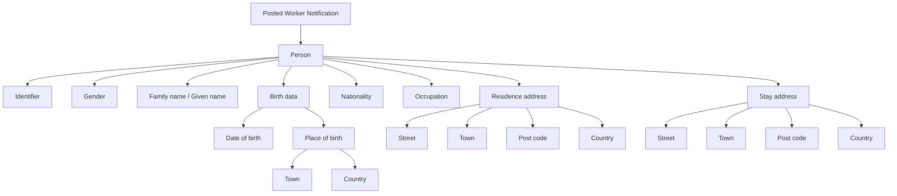
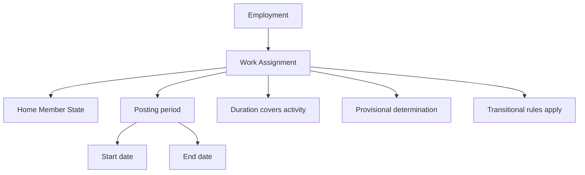
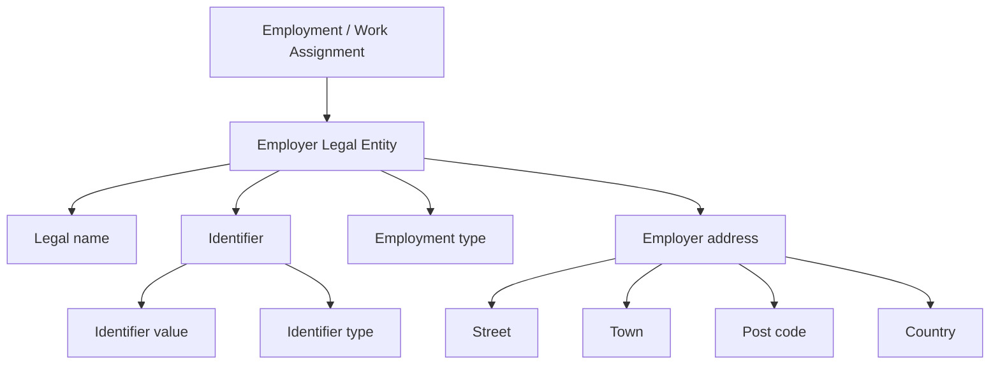
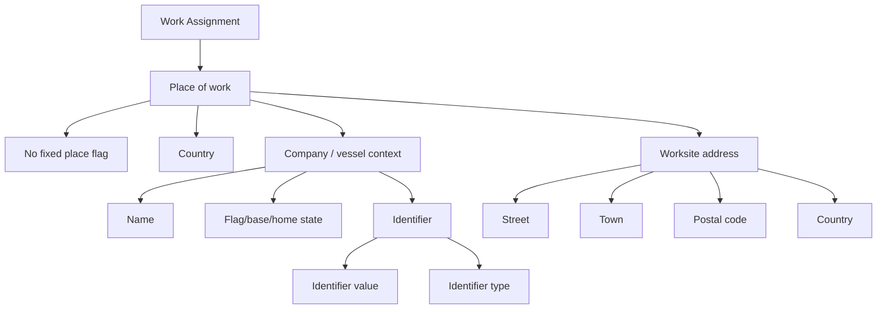
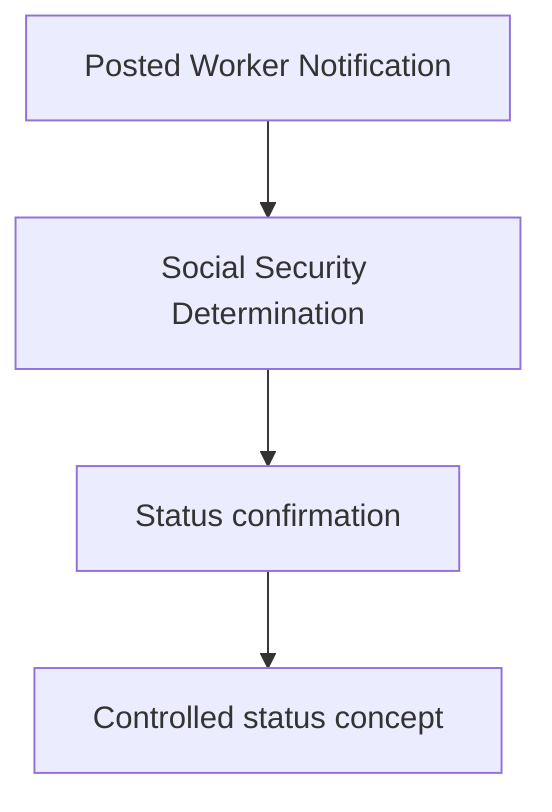
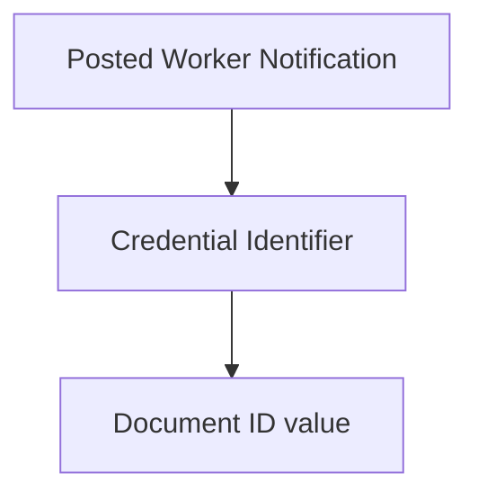
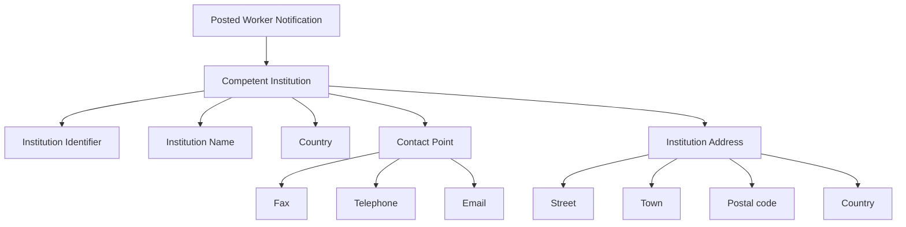

# Posted Worker Notification (PWN) – Detailed SHACL Mapping

This document provides an easy-to-understand but semantically precise description of the **Posted Worker Notification (PWN)** SHACL data model. It is structured according to the logical parts of the attestation and, for each section, maps the **original attestation data elements** from the Excel sheet to the **corresponding SHACL nodes and properties**.

The document is written for GitHub publication and uses Mermaid diagrams to make each section visually easier to understand.

## Table of Contents

- [1. Subject](#1-subject)
- [2. Assignment related information](#2-assignment-related-information)
- [3. Details of Employer(s)/Self-employment](#3-details-of-employer-s-self-employment)
- [4. Place(s) of work](#4-place-s-of-work)
- [5. Status confirmation](#5-status-confirmation)
- [6. Unique Number of Issued Document (Credential)](#6-unique-number-of-issued-document-credential)
- [7. Competent Institution](#7-competent-institution)

## 1. Subject

### Section overview

This section models the posted worker as a natural person, including identity, civil-status-related personal data, nationality, occupation, place of birth, and residential or stay addresses. In Linked Data terms, the person is the core subject node, while identifiers, countries, occupations, and addresses are modelled as linked nodes or constrained values.

### Visual model

### SHACL property-level mapping

| SHACL node / property | Meaning in this attestation | Underlying vocabulary alignment |
|---|---|---|
| `webpwn:Person` | Root node for the worker | `eu-core:Person` |
| `webpwn:hasIdentifier` | PIN / personal ID number | `ncbv:identifier` |
| `webpwn:gender` | Gender of the worker | `eu-core:gender` |
| `webpwn:familyName` | Family name / surname | `foaf:familyName or equivalent person-name property` |
| `webpwn:givenName` | Forename(s) | `foaf:givenName or equivalent person-name property` |
| `webpwn:birthName` | Surname / forename at birth where separately captured | `Specialized person-name property` |
| `webpwn:dateOfBirth` | Date of birth | `eu-core:dateOfBirth` |
| `webpwn:nationality` | Nationality country | `eu-core:country / Country node` |
| `webpwn:hasOccupation` | Job title in home country | `Occupation node / occupation property` |
| `webpwn:placeOfBirth` | Place of birth | `Birth place / Location pattern` |
| `webpwn:postalAddress` | Residence and stay addresses | `ncbv:postalAddress / eu-core:Address` |

### Original attestation data elements

| Original element | Description |
|---|---|
| `1.1 PIN` | Personal Identification Number/ ID number |
| `1.2 Gender` |  |
| `1.3 Familyname(s)` |  |
| `1.4 Forename(s)` |  |
| `1.5 Surname at birth` |  |
| `1.6 Forename(s) at birth` |  |
| `1.7 Date of Birth` |  |
| `1.8 Nationality` |  |
| `1.9 Job Title in Home Country` |  |
| `1.9 Place of Birth` |  |
| `1.9.1 Town` |  |
| `1.9.2 Country code` |  |
| `1.10 Address` |  |
| `1.10.1 Address in the state of residence` |  |
| `1.10.1.1 Street, N°` |  |
| `1.10.1.2 Town` |  |
| `1.10.1.3 Post code` |  |
| `1.10.1.4 Country code` |  |
| `1.10.2 Address in the state of stay` |  |
| `1.10.2.1 Street, N°` |  |
| `1.10.2.2 Town` |  |
| `1.10.2.3 Post code` |  |
| `1.10.2.4 Country code` |  |

[Back to Top](#table-of-contents)

---

## 2. Assignment related information

### Section overview

This section models the cross-border work assignment itself: the home Member State, the posting period, and legal qualification flags describing whether the determination is provisional, transitional, or valid for the whole duration of the activity. In semantic terms, this belongs to the employment or work-assignment layer rather than to the person node.

### Visual model

### SHACL property-level mapping

| SHACL node / property | Meaning in this attestation | Underlying vocabulary alignment |
|---|---|---|
| `webpwn:Employment` | Employment relationship context | `webuild:Employment` |
| `webpwn:hasWorkAssignment` | Links the employment to a concrete posting / assignment | `webuild:WorkAssignment` |
| `webpwn:homeMemberState` | State of origin / competent home jurisdiction | `Jurisdiction / Country` |
| `webpwn:hasPeriod` | Posting period as a dedicated time node | `PeriodOfTime` |
| `webpwn:startDate` | Starting date of posting | `Temporal start` |
| `webpwn:endDate` | Ending date of posting | `Temporal end` |
| `webpwn:appliesForDurationOfActivity` | Boolean or coded flag | `Determination qualifier` |
| `webpwn:isProvisional` | Provisional determination flag | `Determination qualifier` |
| `webpwn:transitionalRulesApply` | Transitional-rules flag | `Determination qualifier` |

### Original attestation data elements

| Original element | Description |
|---|---|
| `2.1 Home Member state` |  |
| `2.2 Starting date` |  |
| `2.3 Ending date` |  |
| `2.4 Certificate applies for the duration of the activity` |  |
| `2.5 Determination is provisional` |  |
| `2.6 Transitional rules apply` |  |

[Back to Top](#table-of-contents)

---

## 3. Details of Employer(s)/Self-employment

### Section overview

This section models the sending employer or, where relevant, self-employment context. The legal entity is represented separately from the person and linked through the employment or work-assignment pattern. Identifier typing is especially important here, because the form captures both the identifier value and the type of identifier used.

### Visual model

### SHACL property-level mapping

| SHACL node / property | Meaning in this attestation | Underlying vocabulary alignment |
|---|---|---|
| `webpwn:LegalEntity` | Employer or self-employed business actor | `eu-core:LegalEntity` |
| `webpwn:legalName` | Employer name | `Legal entity name` |
| `webpwn:hasIdentifier` | Employer identifier | `ncbv:identifier` |
| `webpwn:identifierType` | Type of employer identifier | `Identifier classification` |
| `webpwn:employmentType` | Type of employment / temporary indicator | `Employment classification` |
| `webpwn:postalAddress` | Employer address | `ncbv:postalAddress / eu-core:Address` |

### Original attestation data elements

| Original element | Description |
|---|---|
| `3.1 Type of Employment (Temporary?)` |  |
| `3.2 Name` |  |
| `3.3 EmployerID` |  |
| `3.4 Type of ID` |  |
| `3.5 Address` |  |
| `3.5.1 Street, N°` |  |
| `3.5.2 Town` |  |
| `3.5.3 Post code` |  |
| `3.5.4 Country code` |  |

[Back to Top](#table-of-contents)

---

## 4. Place(s) of work

### Section overview

This section models the actual place of work in the host state, including both ordinary worksite situations and cases where no fixed place of work exists. It may also capture vessel or company-related contextual data, which means the model often combines location, legal-entity, and jurisdictional information.

### Visual model

### SHACL property-level mapping

| SHACL node / property | Meaning in this attestation | Underlying vocabulary alignment |
|---|---|---|
| `webpwn:Location` | Place of work node | `Location / Address pattern` |
| `webpwn:noFixedPlaceOfWork` | No fixed place of work flag | `Location qualifier` |
| `webpwn:country` | Country of work | `Country / jurisdiction` |
| `webpwn:hostOrganization` | Company or vessel operating context | `LegalEntity / organization link` |
| `webpwn:legalName` | Company / vessel name | `Legal entity name` |
| `webpwn:flagBaseHomeState` | Flag/base/home state for vessel context | `Jurisdiction / country` |
| `webpwn:hasIdentifier` | Company identifier | `ncbv:identifier` |
| `webpwn:identifierType` | Type of company identifier | `Identifier classification` |
| `webpwn:postalAddress` | Address of place of work | `ncbv:postalAddress / eu-core:Address` |

### Original attestation data elements

| Original element | Description |
|---|---|
| `4.1 No fixed place of work exists` |  |
| `4.1.1 Country code` |  |
| `4.2 Place of work` |  |
| `4.2.1 Company/vessel name` |  |
| `4.2.2 Flag Base Home State` |  |
| `4.2.3 CompanyID` |  |
| `4.2.4 Type of ID ` |  |
| `4.2.5 Street, N°` |  |
| `4.2.6 Town` |  |
| `4.2.7 Postal Code` |  |
| `4.2.8 Country code` |  |

[Back to Top](#table-of-contents)

---

## 5. Status confirmation

### Section overview

This section expresses the formal status determination behind the attestation. In a high-quality Linked Data model, this should normally be represented as a dedicated determination node with a coded status value rather than as a free-text literal only.

### Visual model

### SHACL property-level mapping

| SHACL node / property | Meaning in this attestation | Underlying vocabulary alignment |
|---|---|---|
| `webpwn:SocialSecurityDetermination` | Determination node supporting the attestation status | `Determination / status class` |
| `webpwn:status` | Status confirmation value | `skos:Concept or controlled code` |

### Original attestation data elements

| Original element | Description |
|---|---|
| `5.1 Status confirmation` |  |

[Back to Top](#table-of-contents)

---

## 6. Unique Number of Issued Document (Credential)

### Section overview

This section captures the identifier of the attestation itself. From a W3C VC and Linked Data perspective, this is a credential-level identifier, not an identifier of the worker or employer.

### Visual model

### SHACL property-level mapping

| SHACL node / property | Meaning in this attestation | Underlying vocabulary alignment |
|---|---|---|
| `webpwn:PostedWorkerNotification` | Credential / attestation root node | `PWN attestation class` |
| `webpwn:hasIdentifier` | Document identifier link | `ncbv:identifier` |
| `webpwn:identifierValue` | Document ID value | `Identifier literal` |

### Original attestation data elements

| Original element | Description |
|---|---|
| `6.1 Document ID` |  |

[Back to Top](#table-of-contents)

---

## 7. Competent Institution

### Section overview

This section models the authority or competent institution responsible for the attestation. It is usually a public organization with its own identifier, legal name, address, and contact point. In semantic modelling, contact details are best grouped under a dedicated contact point node rather than scattered as unrelated literals.

### Visual model

### SHACL property-level mapping

| SHACL node / property | Meaning in this attestation | Underlying vocabulary alignment |
|---|---|---|
| `webpwn:PublicOrganization` | Competent institution | `eu-core:PublicOrganization` |
| `webpwn:hasIdentifier` | Institution identifier | `ncbv:identifier` |
| `webpwn:legalName` | Institution name | `Organization name` |
| `webpwn:country` | Institution country | `Country / jurisdiction` |
| `webpwn:hasContactPoint` | Link to contact details | `eu-core:ContactPoint` |
| `webpwn:faxNumber` | Office fax | `ContactPoint property` |
| `webpwn:telephone` | Office phone | `ContactPoint property` |
| `webpwn:email` | Office email | `ContactPoint property` |
| `webpwn:postalAddress` | Institution address | `ncbv:postalAddress / eu-core:Address` |

### Original attestation data elements

| Original element | Description |
|---|---|
| `7.1 InstitutionID` |  |
| `7.2 Institution Name` |  |
| `7.3 Country code` |  |
| `7.4 Office fax N°` |  |
| `7.5 Office phone N°` |  |
| `7.6 E-Mail` |  |
| `7.7 Street, N°` |  |
| `7.8 Town` |  |
| `7.9 Postal Code` |  |
| `7.10 Country code` |  |
| `Details of Home Employer(s)/Self-employment` |  |
| `Company (name / full commercial firm name)` |  |
| `Industry Sector (NACE)` |  |
| `Construction Sector (Yes/No)` |  |
| `VAT identification number` |  |
| `Address Line 1` |  |
| `Address Line 2` |  |
| `Postal code (company headquarters)` |  |
| `City (company headquarters)` |  |
| `Municipality` |  |
| `State` |  |
| `Country (company headquarters)` |  |
| `Phone number` |  |
| `Email Address` |  |
| `Administrative Represenative` |  |
| `Last Name` |  |
| `First Name` |  |
| `Telephone Number` |  |
| `Email Address` |  |
| `Address Line 1` |  |
| `Address Line 2` |  |
| `Postal code ` |  |
| `City ` |  |
| `Municipality` |  |
| `State` |  |
| `Country ` |  |
| `Social Represenative` |  |
| `Last Name` |  |
| `First Name` |  |
| `Telephone Number` |  |
| `Email Address` |  |
| `Address Line 1` |  |
| `Address Line 2` |  |
| `Postal code ` |  |
| `City ` |  |
| `Municipality` |  |
| `State` |  |
| `Country ` |  |
| `Host Company` |  |
| `Company (name / full commercial firm name)` |  |
| `Email address` |  |
| `Telephone Number` |  |
| `Industry Sector` |  |
| `VAT identification number` |  |
| `Address Line 1` |  |
| `Address Line 2` |  |
| `Postal code (company headquarters)` |  |
| `City (company headquarters)` |  |
| `Municipality` |  |
| `State` |  |
| `Country (company headquarters)` |  |
| `Employee` |  |
| `Job Duties (Activities abroad)` |  |

[Back to Top](#table-of-contents)

---
