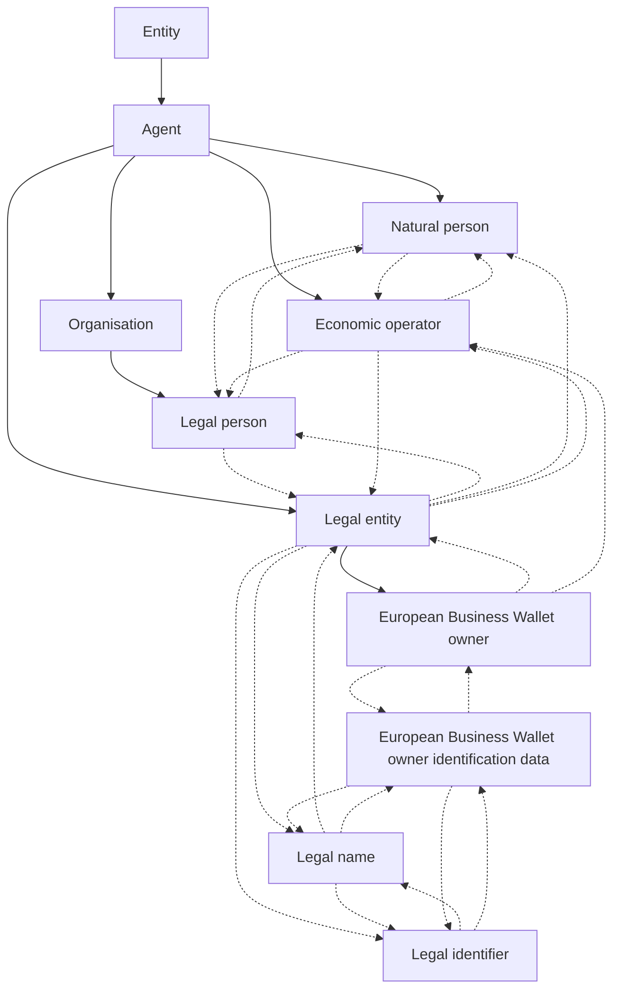

# WE BUILD core actor concepts

This page provides a **plain-language overview** of ten core concepts used in the WE BUILD terminology. The aim is to help non-experts understand how the concepts relate to each other, while staying faithful to the authoritative SKOS definitions used in the project.

The concepts are organised from **general to specific**, with navigation links to move up and down the conceptual structure.

---

## Concept map (Mermaid)

---

## 🧭 Navigation

1. [Agent](#agent)
2. [Natural person](#natural-person)
3. [Organisation](#organisation)
4. [Legal person](#legal-person)
5. [Legal entity](#legal-entity)
6. [Economic operator](#economic-operator)
7. [Legal name](#legal-name)
8. [Legal identifier](#legal-identifier)
9. [European Business Wallet owner](#european-business-wallet-owner)
10. [European Business Wallet owner identification data](#european-business-wallet-owner-identification-data)

---

## Agent

**PrefLabel (en):** Agent

**Definition**  
An entity that can perform actions or be treated as acting within a process.

**Notes**  
Agent is a general actor concept in WE BUILD. It is intentionally broad and can cover human actors, organisations, and legally recognised entities. Depending on context, an agent may act on its own behalf or on behalf of another party.

**Relationships**  
- **Broader:** Entity
- **Narrower:** Natural person, Organisation, Legal entity, Economic operator

[⬆ Back to navigation](#-navigation)

---

## Natural person

**PrefLabel (en):** Natural person

**Definition**  
A human being recognised by law as an individual subject of rights and obligations.

**Notes**  
A natural person exists independently of registration. A natural person may act in a private capacity or in a professional or commercial capacity. Acting economically does not make a natural person a legal person; it only reflects the role of an economic operator.

**Relationships**  
- **Broader:** Agent
- **Related:** Economic operator, Legal person

[⬆ Back to navigation](#-navigation)

---

## Organisation

**PrefLabel (en):** Organisation

**Definition**  
A structured arrangement of one or more persons, created to pursue objectives, with roles and rules that enable it to act.

**Notes**  
An organisation may or may not have legal personality. When an organisation is recognised by law as having its own legal personality, it is considered a legal person. The concept of organisation is therefore broader than legal person.

**Relationships**  
- **Broader:** Agent
- **Narrower:** Legal person

[⬆ Back to navigation](#-navigation)

---

## Legal person

**PrefLabel (en):** Legal person

**Definition**  
An entity other than a natural person that is recognised by law as having legal personality, enabling it to hold rights and obligations independently of its members or representatives.

**Notes**  
Legal persons are typically created through a formal legal act, such as registration or statute. They act through authorised representatives and usually have continuity beyond individual members.

**Relationships**  
- **Broader:** Organisation
- **Related:** Natural person, Legal entity

[⬆ Back to navigation](#-navigation)

---

## Legal entity

**PrefLabel (en):** Legal entity

**Definition**  
An agent whose identity is legally recognised for transactions and that can be referenced unambiguously by a legal identifier issued or recognised by a competent authority.

**Notes**  
In WE BUILD, legal entity is an **operational concept** used in business and public-sector processes. It can include legal persons and, in some jurisdictions, natural persons acting as registered business actors (such as sole traders). The key feature is the existence of a legally recognised identifier.

**Relationships**  
- **Broader:** Agent
- **Narrower:** European Business Wallet owner
- **Related:** Legal person, Natural person, Legal name, Legal identifier, Economic operator

[⬆ Back to navigation](#-navigation)

---

## Economic operator

**PrefLabel (en):** Economic operator

**Definition**  
An agent acting in a commercial or professional capacity for purposes related to its trade, business, craft, or profession.

**Notes**  
Economic operator describes a **role or capacity**, not a distinct type of entity. The same underlying entity may or may not be an economic operator depending on the context. The exact scope of the term depends on the applicable legal instrument.

**Relationships**  
- **Broader:** Agent
- **Related:** Natural person, Legal person, Legal entity

[⬆ Back to navigation](#-navigation)

---

## Legal name

**PrefLabel (en):** Legal name

**Definition**  
The name under which a legal entity is officially registered or officially recorded by a competent authority.

**Notes**  
The legal name is the authoritative name used in legal and regulated contexts. It may differ from trade names or brand names and may exist in multiple language forms depending on the register.

**Relationships**  
- **Related:** Legal entity, Legal identifier, European Business Wallet owner identification data

[⬆ Back to navigation](#-navigation)

---

## Legal identifier

**PrefLabel (en):** Legal identifier

**Definition**  
An unambiguous structured identifier assigned to a legal entity by the competent authority that registered or recognised it.

**Notes**  
Legal identifiers enable reliable referencing and matching of entities across systems. They should be distinguished from sector-specific identifiers unless governance explicitly treats those as legal identifiers.

**Relationships**  
- **Broader:** Legal entity
- **Related:** Legal name, European Business Wallet owner identification data

[⬆ Back to navigation](#-navigation)

---

## European Business Wallet owner

**PrefLabel (en):** European Business Wallet owner

**Definition**  
An economic operator or public sector body to which a European Business Wallet is issued or assigned and that has the right to control and use that wallet instance under the applicable framework.

**Notes**  
This concept refers to the organisational owner of the wallet instance. It does not refer to beneficial owners or to individual representatives who may act on behalf of the owner through mandates or authorisations.

**Relationships**  
- **Broader:** Agent
- **Related:** Legal entity, Economic operator, European Business Wallet owner identification data

[⬆ Back to navigation](#-navigation)

---

## European Business Wallet owner identification data

**PrefLabel (en):** European Business Wallet owner identification data

**Definition**  
A set of data that enables the establishment of the identity of a European Business Wallet owner, issued or attested by a recognised provider.

**Notes**  
At a minimum, this data set typically includes the legal name and one or more legal identifiers of the wallet owner. In the regulatory context, such data is expected to be issued as electronic attestations of attributes and to support cross-border recognition.

**Relationships**  
- **Related:** European Business Wallet owner, Legal name, Legal identifier

[⬆ Back to navigation](#-navigation)

---

*This page is based on the latest WE BUILD SKOS terminology and is intended as an explanatory aid. The SKOS vocabulary itself remains the authoritative source.*
